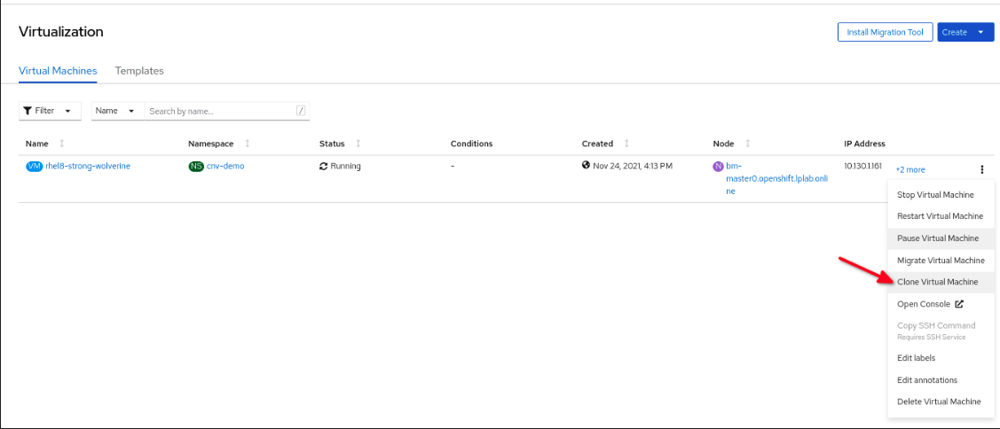

In this lab we're going to clone a workload and prove that it's identical to the previous. For convenience we're going to download and customise a Fedora 34 image, launch a virtual machine via OpenShift Virtualization based on it, install a basic application inside the VM, and then clone it - we'll then test to see if the cloned machine works as expected and is "the same" as before. Before we begin we need to setup our Fedora 34 cloud image, let's first connect to our bastion host as we need somewhere to process and serve the image:

~~~bash
$ ssh root@192.168.123.100
(password is "redhat")
~~~

Change directory to `/var/www/html` and download the latest Fedora 34 cloud image there:

~~~bash
# cd /var/www/html

# wget https://www.mirrorservice.org/sites/dl.fedoraproject.org/pub/fedora/linux/releases/34/Cloud/x86_64/images/Fedora-Cloud-Base-34-1.2.x86_64.raw.xz
(...)

# xz -d Fedora-Cloud-Base-34-1.2.x86_64.raw.xz
(no output but may take a minute)

# ls -l | grep -i fedora
-rw-r--r--. 1 root root  5368709120 Apr 23  2021 Fedora-Cloud-Base-34-1.2.x86_64.raw
~~~

Now we need to customise this image, we're going to do the following:

* Permit root login over ssh
* Reset the root password to "redhat"

~~~bash
# dnf install libguestfs-tools -y
(...)

# systemctl enable --now libvirtd

# virt-customize -a /var/www/html/Fedora-Cloud-Base-34-1.2.x86_64.raw --run-command 'sed -i s/^#PermitRootLogin.*/PermitRootLogin\ yes/ /etc/ssh/sshd_config && touch /.autorelabel'

[   0.0] Examining the guest ...
(...)

# virt-customize -a /var/www/html/Fedora-Cloud-Base-34-1.2.x86_64.raw --uninstall=cloud-init --root-password password:redhat --ssh-inject root:file:/root/.ssh/id_rsa.pub

[   0.0] Examining the guest ...
(...)

# exit
logout
Connection to ocp4-bastion closed.

$ oc whoami
system:serviceaccount:workbook:cnv
~~~

> **NOTE**: Make sure that you've disconnected from this machine, and  before proceeding.

Now that we've prepared our Fedora 34 VM and placed it on an accessible location on our bastion host: (for reference it's at: http://192.168.123.100:81/Fedora-Cloud-Base-34-1.2.x86_64.raw).

Let's build a PVC that will eventually house a copy of this image so we can build a VM from it afterwards, this utilises the CDI utility to get the Fedora image from the endpoint we placed it on:

~~~bash
$ cat << EOF | oc apply -f -
apiVersion: v1
kind: PersistentVolumeClaim
metadata:
  name: "fc34-original"
  labels:
    app: containerized-data-importer
  annotations:
    cdi.kubevirt.io/storage.import.endpoint: "http://192.168.123.100:81/Fedora-Cloud-Base-34-1.2.x86_64.raw"
spec:
  volumeMode: Block
  storageClassName: ocs-storagecluster-ceph-rbd
  accessModes:
  - ReadWriteMany
  resources:
    requests:
      storage: 40Gi
EOF

persistentvolumeclaim/fc34-original created
~~~

And make sure the claim is `Bound` and has a matching volume:

~~~bash
$ oc get pvc
NAME            STATUS   VOLUME                                     CAPACITY   ACCESS MODES   STORAGECLASS                  AGE
fc34-original   Bound    pvc-f335830c-d096-4ffa-8018-a1aac3b3cedf   40Gi       RWX            ocs-storagecluster-ceph-rbd   3m4s
~~~

As before we can watch the process and see the pods (you'll need to be quick with the next two commands, as it's only a 10GB image):

~~~bash
$ oc get pod/importer-fc34-original
NAME                     READY   STATUS    RESTARTS   AGE
importer-fc34-original   1/1     Running   0          21s
~~~

The import:

~~~bash
$ oc logs importer-fc34-original -f
I0319 02:41:06.647561       1 importer.go:51] Starting importer
I0319 02:41:06.651389       1 importer.go:107] begin import process
I0319 02:41:06.654768       1 data-processor.go:275] Calculating available size
I0319 02:41:06.656489       1 data-processor.go:283] Checking out file system volume size.
I0319 02:41:06.656689       1 data-processor.go:287] Request image size not empty.
I0319 02:41:06.656704       1 data-processor.go:292] Target size 10Gi.
I0319 02:41:06.657272       1 data-processor.go:205] New phase: TransferDataFile
I0319 02:41:06.660080       1 util.go:170] Writing data...
I0319 02:41:07.657584       1 prometheus.go:69] 17.53
I0319 02:41:08.657711       1 prometheus.go:69] 17.53
I0319 02:41:09.678442       1 prometheus.go:69] 24.25
~~~

Ctrl-C to exit, or just wait for it to finish... you can also view a stripped down importer description below, noting that it's unlikely that you'll be able to execute this command unless you're very quick!

~~~bash
$ oc describe pod $(oc get pods | awk '/importer/ {print $1;}')
Name:         importer-fc34-original
Namespace:    default
Priority:     0
Node:         ocp4-worker2.aio.example.com/192.168.123.105
Start Time:   Thu, 19 Mar 2020 02:41:03 +0000
Labels:       app=containerized-data-importer
              cdi.kubevirt.io=importer
              cdi.kubevirt.io/storage.import.importPvcName=fc34-original
              prometheus.cdi.kubevirt.io=
Annotations:  cdi.kubevirt.io/storage.createdByController: yes
              k8s.v1.cni.cncf.io/networks-status:
(...)
    Environment:
      IMPORTER_SOURCE:       http
      IMPORTER_ENDPOINT:     http://192.168.123.100:81/Fedora-Cloud-Base-34-1.2.x86_64.raw
      IMPORTER_CONTENTTYPE:  kubevirt
      IMPORTER_IMAGE_SIZE:   10Gi
      OWNER_UID:             6cf06f28-7056-40e8-bb8b-2bac5abbe363
      INSECURE_TLS:          false
    Mounts:
      /data from cdi-data-vol (rw)
      /var/run/secrets/kubernetes.io/serviceaccount from default-token-crznj (ro)
(...)
Volumes:
  cdi-data-vol:
    Type:       PersistentVolumeClaim (a reference to a PersistentVolumeClaim in the same namespace)
    ClaimName:  fc34-original
    ReadOnly:   false
(...)
~~~

### Fedora 34 Virtual Machine

Now it's time to launch our Fedora VM. Again we are just using the same pieces we've been using throughout the labs. For review we are using the `fc34-original` PVC we just prepared (created with CDI importing the Fedora image, stored on OCS), and we are utilising the standard bridged networking on the workers via the `tuning-bridge-fixed` construct - the same as we've been using for the other two virtual machines we created previously:

~~~bash
$ cat << EOF | oc apply -f -
apiVersion: kubevirt.io/v1alpha3
kind: VirtualMachine
metadata:
  name: fc34-original
  labels:
    app: fc34-original
    os.template.kubevirt.io/fedora34: 'true'
    vm.kubevirt.io/template-namespace: openshift
    workload.template.kubevirt.io/server: 'true'
spec:
spec:
  running: true
  template:
    metadata:
      labels:
        vm.kubevirt.io/name: fc34-original
    spec:
      domain:
        cpu:
          cores: 1
          sockets: 1
          threads: 1
        devices:
          disks:
            - bootOrder: 1
              disk:
                bus: virtio
              name: disk0
          interfaces:
            - bridge: {}
              model: virtio
              name: nic0
          networkInterfaceMultiqueue: true
          rng: {}
        machine:
          type: pc-q35-rhel8.1.0
        resources:
          requests:
            memory: 2Gi
      evictionStrategy: LiveMigrate
      hostname: fc34-original
      networks:
        - multus:
            networkName: tuning-bridge-fixed
          name: nic0
      terminationGracePeriodSeconds: 0
      volumes:
        - name: disk0
          persistentVolumeClaim:
            claimName: fc34-original
EOF

virtualmachine.kubevirt.io/fc34-original created
~~~

We can view the running VM:

~~~bash
$ oc get vmi
NAME            AGE   PHASE     IP               NODENAME                       READY
fc34-original   65s   Running   192.168.123.64   ocp4-worker3.aio.example.com   True
~~~

> **NOTE:** The IP address for the Fedora 34 virtual machine may be missing in your output above as it takes a while for the `qemu-guest-agent` to report the data through to OpenShift and we also requested an SELinux relabel, so we'll need to be patient.

When you've got an IP address, we should be able to SSH to it from our terminal window, noting you'll need to adapt the address below to match your environment:

~~~bash
$ oc get vmi/fc34-original
NAME            AGE   PHASE     IP               NODENAME                       READY
fc34-original   11m   Running   192.168.123.64   ocp4-worker3.aio.example.com   True

$ ssh root@192.168.123.64
(the password is "redhat")

[root@fedora ~]#
~~~

At this stage, we're going to deploy a basic application into our Fedora-based virtual machine; let's install `nginx` via `systemd` and `podman`, i.e. have *systemd* call *podman* to start an *nginx* container at boot time, and have it display a simple web-page:

~~~bash
[root@fedora ~]# dnf install podman -y
(...)

[root@fedora ~]# cat >> /etc/systemd/system/nginx.service << EOF
[Unit]
Description=Nginx Podman container
Wants=syslog.service
[Service]
ExecStart=/usr/bin/podman run --net=host docker.io/nginxdemos/hello:plain-text
ExecStop=/usr/bin/podman stop --all
[Install]
WantedBy=multi-user.target
EOF

[root@fedora ~]# systemctl enable --now nginx

Created symlink /etc/systemd/system/multi-user.target.wants/nginx.service → /etc/systemd/system/nginx.service.

[root@localhost ~]# systemctl status nginx
● nginx.service - Nginx Podman container
   Loaded: loaded (/etc/systemd/system/nginx.service; enabled; vendor preset: disabled)
   Active: active (running) since Tue 2020-03-31 01:30:48 UTC; 8s ago
 Main PID: 9898 (podman)
    Tasks: 11 (limit: 2345)

(should see "active (running)" in green above)

[root@fedora ~]# logout
Connection to 192.168.123.64 closed.

$ oc whoami
system:serviceaccount:workbook:cnv
~~~

Let's quickly verify that this works as expected - you should be able to navigate directly to the IP address of your machine via `curl` - recalling that in my example it's *192.168.123.64*, it may be different for you, but unlikely if you've not created any additional VM's along the way:

~~~bash
$ curl http://192.168.123.69
Server address: 192.168.123.69:80
Server name: fedora
Date: 25/Nov/2021:15:09:21 +0000
URI: /
Request ID: 517056307646f72f6d320830b6a9dfb6
~~~

> **NOTE**: We've purposely installed a plain-text server-side option here as we cannot route to the 192.168.123.0/24 network via the internet. In a later step we'll change this to a visual one and we'll expose it via the OpenShift ingress service, and it'll be available as a route. But let's move on!

Now that we know our VM is working, we need to shutdown the VM so we can clone it without risking filesystem corruption. We'll use the `virtctl` command to help us with this as it saves us logging back into the VM, and instructs VM shutdown via the guest agent:

~~~bash
$ virtctl stop fc34-original
VM fc34-original was scheduled to stop
~~~

Now if you check the list of `vm` objects you should see that it's marked as `Stopped` rather than being automatically restarted by OpenShift Virtualization:

~~~bash
$ oc get vm
NAME            AGE   STATUS    READY
fc34-original   37m   Stopped   False
~~~

### Clone the VM (Option 1)

Now that we've got a working virtual machine with a test workload we're ready to actually clone it, to prove that the built-in cloning utilities work, and that the cloned machine shares the same workload. There are a couple of ways of doing this, first we'll use the CLI to do so, and we'll simply clone the underlying storage volume, to do this we'll need to create a PV (persistent volume) to clone into. This is done by creating a special resource called a `DataVolume`, this custom resource type is provide by CDI. DataVolumes orchestrate import, clone, and upload operations and help the process of importing data into a cluster. DataVolumes are integrated into OpenShift Virtualization.

The volume we are creating is named `fc34-clone` and we'll be pulling the data from the volume ("source") `fc34-original`:

~~~bash
$ cat << EOF | oc apply -f -
apiVersion: cdi.kubevirt.io/v1alpha1
kind: DataVolume
metadata:
  name: fc34-clone
spec:
  source:
    pvc:
      namespace: default
      name: fc34-original
  pvc:
    volumeMode: Block
    storageClassName: ocs-storagecluster-ceph-rbd
    accessModes:
      - ReadWriteMany
    resources:
      requests:
        storage: 40Gi
EOF

datavolume.cdi.kubevirt.io/fc34-clone created
~~~

Usually, a clone goes through a number of stages, where you can watch the progress where it will go through `CloneScheduled` and `CloneInProgress` phases along with a handy status percentage, but in our case we're using OpenShift Container Storage which takes an instant clone of a volume within the storage platform for us. So I'm providing the below output to show you what it would usually look like on a platform that didn't support such functionality, e.g. NFS, there's no need to type *these* commands:

~~~bash
$ oc get pods
NAME                                              READY   STATUS              RESTARTS   AGE
3c3943f9-0a5c-4ce9-a913-782f8754f418-source-pod   0/1     ContainerCreating   0          6s
cdi-upload-fc34-clone                             1/1     Running             0          34s

$ watch -n5 oc get datavolume
Every 5.0s: oc get datavolume

NAME         PHASE            PROGRESS   AGE
fc34-clone   CloneScheduled              39s
(...)

NAME         PHASE             PROGRESS   AGE
fc34-clone   CloneInProgress   27.38%     2m46s
(...)

NAME         PHASE       PROGRESS   AGE
fc34-clone   Succeeded   100.0%     3m13s

(Ctrl-C to stop/quit)
~~~

Regardless, you should be able to view the status of our clone, and it should say "**Succeeded**", and we should be able to view all your PVCs including the new clone:

~~~bash
$ oc get dv/fc34-clone
NAME         PHASE       PROGRESS   RESTARTS   AGE
fc34-clone   Succeeded                         4m

$ oc get pvc
NAME            STATUS   VOLUME                                     CAPACITY   ACCESS MODES   STORAGECLASS                  AGE
fc34-clone      Bound    pvc-3c3943f9-0a5c-4ce9-a913-782f8754f418   40Gi       RWX            ocs-storagecluster-ceph-rbd   83s
fc34-original   Bound    pvc-f335830c-d096-4ffa-8018-a1aac3b3cedf   40Gi       RWX            ocs-storagecluster-ceph-rbd   41m
~~~

### Start the cloned VM

Finally we can start up a new VM using the cloned PVC, let's create a new definition of a `VirtualMachine` to house this VM and start it automatically (`running: true`):

~~~bash
$ cat << EOF | oc apply -f -
apiVersion: kubevirt.io/v1alpha3
kind: VirtualMachine
metadata:
  name: fc34-clone
  labels:
    app: fc34-clone
    os.template.kubevirt.io/fedora34: 'true'
    vm.kubevirt.io/template-namespace: openshift
    workload.template.kubevirt.io/server: 'true'
spec:
spec:
  running: true
  template:
    metadata:
      labels:
        vm.kubevirt.io/name: fc34-clone
    spec:
      domain:
        cpu:
          cores: 1
          sockets: 1
          threads: 1
        devices:
          disks:
            - bootOrder: 1
              disk:
                bus: virtio
              name: disk0
          interfaces:
            - bridge: {}
              model: virtio
              name: nic0
          networkInterfaceMultiqueue: true
          rng: {}
        machine:
          type: pc-q35-rhel8.1.0
        resources:
          requests:
            memory: 2Gi
      evictionStrategy: LiveMigrate
      hostname: fc34-clone
      networks:
        - multus:
            networkName: tuning-bridge-fixed
          name: nic0
      terminationGracePeriodSeconds: 0
      volumes:
        - name: disk0
          persistentVolumeClaim:
            claimName: fc34-clone
EOF

virtualmachine.kubevirt.io/fc34-clone created
~~~

After a few minutes you should see the new virtual machine running:

~~~bash
$ oc get vm
NAME            AGE   STATUS    READY
fc34-clone      84s   Running   True
fc34-original   76m   Stopped   False

$ oc get vmi
NAME         AGE   PHASE     IP               NODENAME                       READY
fc34-clone   88s   Running   192.168.123.70   ocp4-worker2.aio.example.com   True
~~~

> **Note** Give the command 2-3 minutes to report the IP. 

This machine will also be visible from the OpenShift Virtualization console, and you can login using "**root/redhat**" if you want to try:

### Test the clone

Like before, we should be able to just directly connect to the VM on port 80 via `curl` and it should show our simple NGINX based application responding... at least it should, if the clone worked properly. Let's try it! Remember to adapt to the IP address of *your* machine:

~~~bash
$ curl http://192.168.123.70
Server address: 192.168.123.70:80
Server name: fedora
Date: 25/Nov/2021:15:58:20 +0000
URI: /
Request ID: 30d16f4250df0d0d82ec2af2ebb60728
~~~

There we go, our VM was cloned, at least the backend storage volume was cloned and we created a new virtual machine from it. Now you're probably thinking "wow, that was a lot of work just to clone a VM", and you'd be right! There's a much more simple workflow via the UI, and one that copies over all of the same configuration without us having to define a new VM ourselves. Let's first delete our clone, and then we'll move onto re-cloning the original via the UI:

~~~bash
$ oc delete vm/fc34-clone oc delete dv/fc34-clone pvc/fc34-clone
virtualmachine.kubevirt.io "fc34-clone" deleted
datavolume.cdi.kubevirt.io "fc34-clone" deleted
persistentvolumeclaim "fc34-clone" deleted
~~~

Now, if we navigate to the OpenShift Console, and ensure that we're in the list of Virtual Machines by selecting "**Workloads**" --> "**Virtualization**", we should see our "*fc34-original*" VM as stopped:

Select "*fc34-original*" and then from the "**Actions**" drop-down on the right hand side, select "**Clone Virtual Machine**". This will bring up a new window where we can confirm our requirements:

We'll leave the defaults here, but make sure to select "**Start virtual machine on clone**" as this will ensure that our freshly cloned VM is automatically started for us. When you're ready, select the blue "**Clone Virtual Machine**" button at the bottom; this will create an identical virtual machine for us, just with a new name, "*fc34-original-clone*".

As soon as this happens, a new virtual machine will be created and started for you. You can see this in "**Workloads**" --> "**Virtualization**" or via the CLI:

~~~bash
$ oc get vm
NAME                  AGE    STATUS    READY
fc34-original         106m   Stopped   False
fc34-original-clone   89s    Running   True

$ oc get vmi
NAME                  AGE   PHASE     IP               NODENAME                       READY
fc34-original-clone   89s   Running   192.168.123.71   ocp4-worker3.aio.example.com   True
~~~

Like before, we should be able to confirm that it really is our clone:

~~~bash
$ curl http://192.168.123.71
Server address: 192.168.123.71:80
Server name: fedora
Date: 25/Nov/2021:16:26:05 +0000
URI: /
Request ID: a966b369edd1941e931d5caddcb099df
~~~

There we go! We have successfully cloned a VM via the CLI (and backend DataVolume) as well as used the UI to do it for us. Let's clean up our clone, and our original before proceeding:

~~~bash
$ oc delete vm/fc34-original vm/fc34-original-clone
virtualmachine.kubevirt.io "fc34-original" deleted
virtualmachine.kubevirt.io "fc34-original-clone" deleted
~~~

### Cloning VM using Openshift Console(Option 2)

Firstly, we are installing httpd package for test.You can use same virtual machine as you have created before

~~~bash
$ yum install httpd -y
$ systemctl start httpd
$ systemctl enable httpd
~~~

And lets  check your HTTP server via browser. First of all , you should get your VM's current public ip then try to connect using this ip.That's it.

Then we are starting clone  job as you can see below screenshot.

I can change namespace and after finishing clone,  I can start this VM. You'll need to click "**Clone Virtual Machine**" button.

As you can see your console, current vm is closing now, and new vm is provisioning. 

At this point, I'll need some test for this new vm. I am starting VM now. You'll need to click  "**...**" and "**Start Virtual Machine**" buttons.

After vm started , check current public ip and then connect your browser with this new ip. That's it.

### Clean up

Before moving on to the next lab let's clean up the VMs so we ensure our environment has all the resources it might need; we're going to delete our VM's

