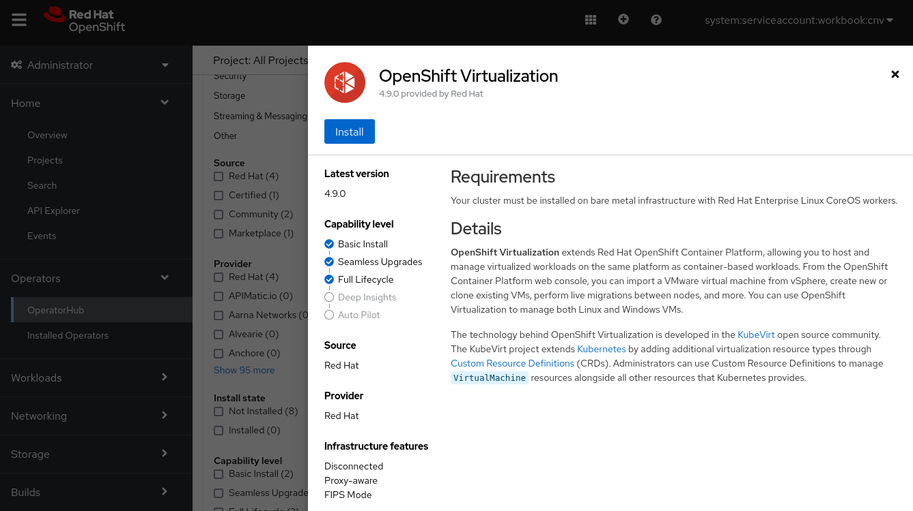
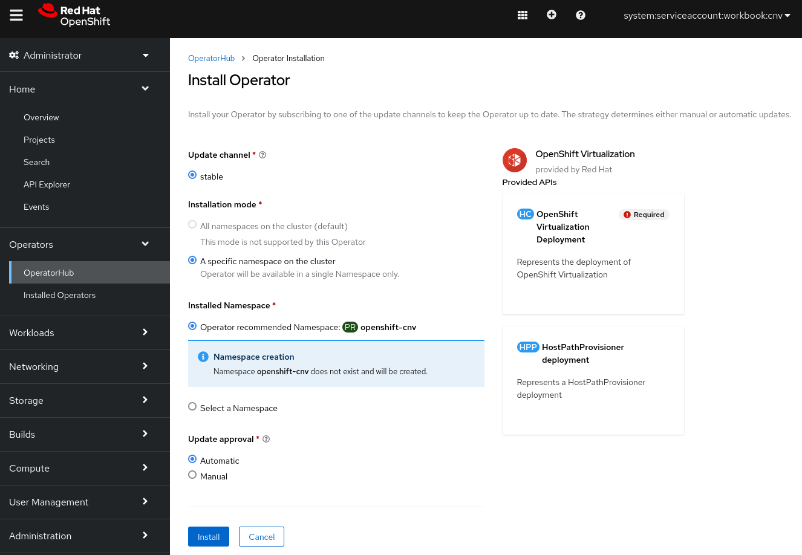
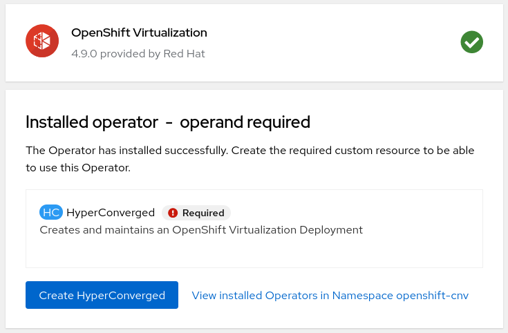
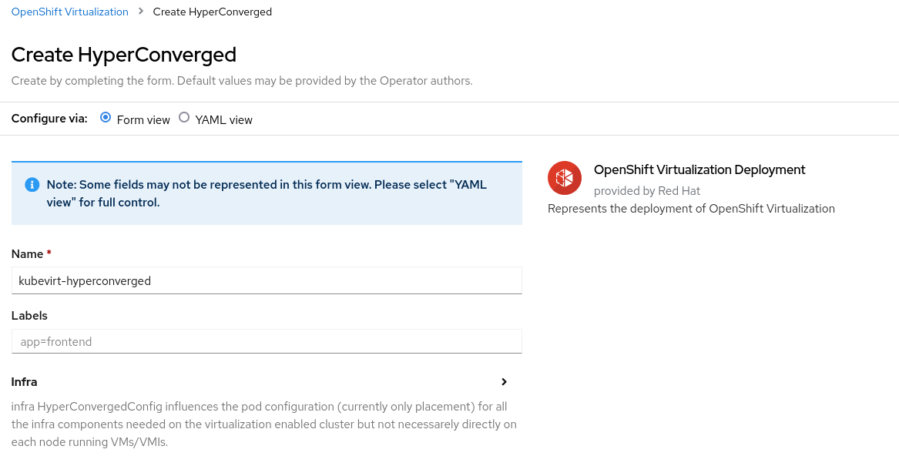
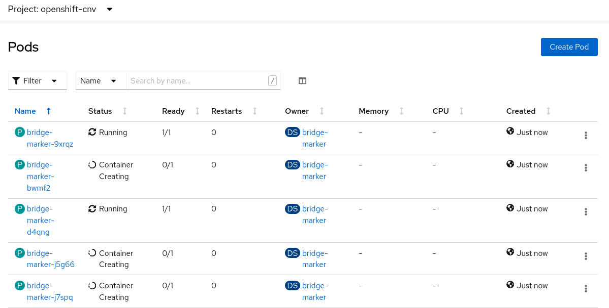
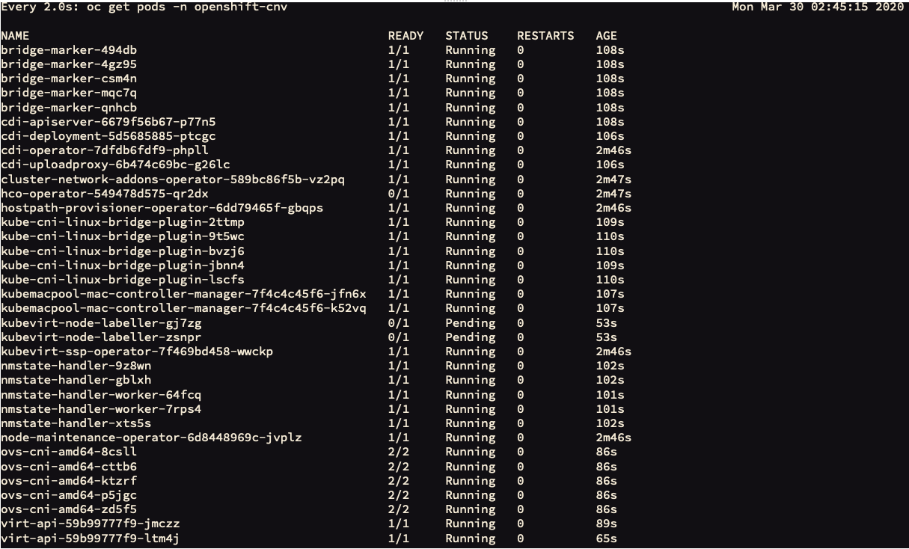
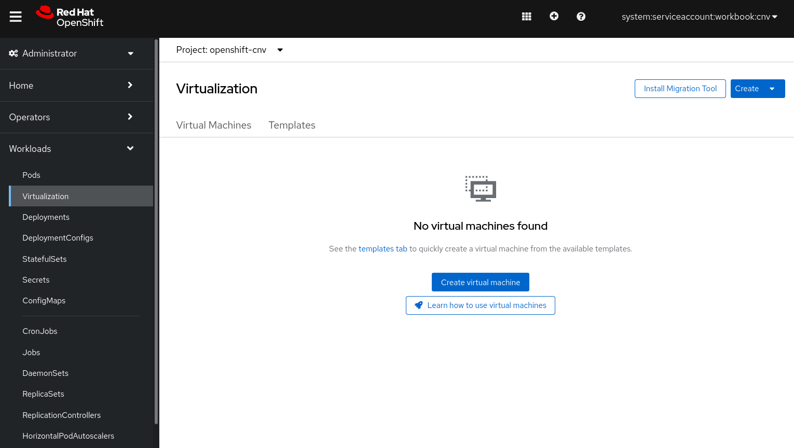

Since OpenShift 4.5, OpenShift Virtualization has been fully supported by Red Hat as a component of OpenShift itself. The mechanism for installation is to utilise the operator model and deploy via the OpenShift Operator Hub in the web-console. Note, it's entirely possible to deploy via the CLI should you wish to do so, but we're not documenting that mechanism here.


Next, navigate to the top-level [Operators -> OperatorHub ](https://console-openshift-console.%cluster_subdomain%/operatorhub/all-namespaces). 
This lists all of the available operators that you can install from the Red Hat Marketplace. Simply start typing '**virtualization**' in the search box and you should see an entry called "OpenShift Virtualization". Simply select it and you'll see a window that looks like the following:




Next you'll want to select the '**Install**' button, which will take you to a second window where you'll be creating an 'Operator Subscription'. Leave the defaults here as they'll automatically select the latest version of OpenShift Virtualization and will allow the software to be installed automatically:




Make sure that the namespace it will be installed to is "**openshift-cnv**" - it should be the default entry, but make sure. When you're ready, press the **'Install'** button. After a minute or two you'll see that the operator has been configured successfully:




Next we need to deploy the HyperConverged resource, which, in addition to the OpenShift Virtualization operator, creates and maintains an OpenShift Virtualization Deployment for the cluster. This may raise some questions about "hyperconverged infrastructures", however this relates to the fact that we're converging virtual machines and containers, and is how an "instance" of OpenShift Virtualization is instantiated - it does not impact the relation between compute and storage as we will see later in the labs. Click on "**Create HyperConverged**" in the same screen to proceed.

This will open the next screen where we can accept all the defaults for this lab - for production use, there are many additional flags, parameters, and attributes that can be applied at this stage, for example enabling tech-preview features, specifying host devices that can be utilised, implementing CPU masks, and so on. Continue the installation by click on "**Create**" at the bottom.




Whilst this does its thing, you can move to the [Workloads -> Pods](https://console-openshift-console.%cluster_subdomain%/k8s/ns/openshift-cnv/pods) menu entry and watch it start all of its resources:




You can also return to the 'terminal' tab in your hosted lab guide and watch via the CLI:

```execute-1
watch -n2 'oc get pods -n openshift-cnv'
```

> **NOTE**: It may take a few minutes for the pods to start up properly. Press **Ctrl+C** to exit the watch command.

During this process you will see a lot of pods create and terminate, which will look something like the following depending on when you view it; it's always changing:



This will continue for some time, depending on your environment.

You will know the process is complete when you can return to the top terminal and see that the operator installation has been successful by running the following command:

```execute-1
oc get csv -n openshift-cnv
```

You should see the output below:

~~~bash
NAME                                      DISPLAY                    VERSION   REPLACES                                  PHASE
kubevirt-hyperconverged-operator.v4.9.0   OpenShift Virtualization   4.9.0     kubevirt-hyperconverged-operator.v4.8.2   Succeeded
~~~

> **NOTE**: You may have slightly newer versions than the ones listed above.

If you do not see `Succeeded` in the `PHASE` column then the deployment may still be progressing, or has failed. You will not be able to proceed until the installation has been successful. Once the `PHASE` changes to `Succeeded` you can validate that the required resources and the additional components have been deployed across the nodes. First let's check the pods deployed in the `openshift-cnv` namespace:


```execute-1
oc get pods -n openshift-cnv
```

This will list the list of pods in *openshift-cnv* project.

~~~bash
NAME                                                  READY   STATUS    RESTARTS   AGE
bridge-marker-52mv7                                   1/1     Running   0          6m55s
bridge-marker-74rzv                                   1/1     Running   0          6m55s
bridge-marker-8h7gd                                   1/1     Running   0          6m55s
bridge-marker-hvdx2                                   1/1     Running   0          6m55s
bridge-marker-lsx48                                   1/1     Running   0          6m55s
bridge-marker-sbmhr                                   1/1     Running   0          6m55s
cdi-apiserver-5b4cfb4d57-4zd72                        1/1     Running   0          6m55s
cdi-deployment-65d77bbf54-bwvtk                       1/1     Running   0          6m55s
cdi-operator-cfbb47d55-5nxhk                          1/1     Running   0          13m
cdi-uploadproxy-5dddc647cb-m8mmp                      1/1     Running   0          6m53s
cluster-network-addons-operator-679485cff4-qkjm9      1/1     Running   0          13m
hco-operator-667cdd75d7-7hmml                         1/1     Running   0          13m
hco-webhook-5c8d75b559-d4h5r                          1/1     Running   0          13m
(...)
~~~

> **NOTE**: All pods shown from this command should be in the `Running` state. You will have many different types, the above snippet is just an example of the output at one point in time, you may have more or less at any one point. Below we discuss some of the pod types and what they do.

You may check by filtering with grep the 'Running' ones and then counting the lines:

```execute-1
oc get pods -n openshift-cnv | grep -v Running
```

This should return an empty result

~~~bash
NAME                                                  READY   STATUS    RESTARTS   AGE
~~~

And when you count the lines

```execute-1
oc get pods -n openshift-cnv |  wc -l
```

It should be **48**


Together, all of these pods are responsible for various functions of running a virtual machine on-top of OpenShift/Kubernetes. See the table below that describes some of the various different pod types and their function:

| Pod Name                             | Pod Responsibilities |
| ------------------------------------ | -------------------- |
| *[bridge-marker](https://github.com/kubevirt/bridge-marker)*                      | Marks network bridges as available node resources.|
| *[cdi-*](https://github.com/kubevirt/containerized-data-importer)*                              | The Containerized Data Importer (CDI) is a Kubernetes extension to populate PVCs with VM disk images or other data. CDI pods allow OpenShift Virtualization to import, upload and clone Virtual Machine images. |
| *[cluster-network-addons-operator](https://github.com/kubevirt/cluster-network-addons-operator)*    | Allows the installation of additional networking plugins. |
| *[hco-operator](https://github.com/kubevirt/hyperconverged-cluster-operator)*                       | Allows users to deploy and configure multiple operators in a single operator and via a single entry point. An "operator of operators." |
| *[hostpath-provisioner-operator](https://github.com/kubevirt/hostpath-provisioner-operator)*      |Operator that manages the hostpath-provisioner, which provisions storage on network filesystems mounted on the host.|
| *[kube-cni-linux-bridge-plugin](https://github.com/containernetworking/plugins)*       |CNI Plugin to create a network bridge and add a host and container to it.|
| *kubemacpool-mac-controller-manager* |Allocation of MAC addresses from a pool to secondary interfaces.|
| *[kubevirt-node-labeller](https://github.com/kubevirt/node-labeller)*             |Creates node labels based on CPU (and other hardware) information.|
| *[kubevirt-ssp-operator](https://github.com/MarSik/kubevirt-ssp-operator)*              |Scheduling, Scale and Performance operator for OpenShift. The Hyperconverged Cluster Operator automatically installs the SSP operator when deploying.|
| *nmstate-handler*                    |Deploys NMState which allows network administrators to manage host networking settings in a declarative manner.|
| *[node-maintenance-operator](https://github.com/kubevirt/cluster-network-addons-operator#nmstate)*|Operator that allows the administrator to deploy the NMState State Controller.                    |
| *[virt-api](https://github.com/kubevirt/kubevirt/tree/master/pkg/virt-api)*                           |Kubernetes Virtualization API and runtime in order to define and manage virtual machines|
| *[virt-controller](https://kubernetes.io/blog/2018/05/22/getting-to-know-kubevirt/)*                    |The operator that’s responsible for cluster-wide virtualisation functionality|
| *[virt-handler](https://kubernetes.io/blog/2018/05/22/getting-to-know-kubevirt/)*                       |Tracks changes to a VM's state.|
| *[virt-template-validator](https://kubernetes.io/blog/2018/05/22/getting-to-know-kubevirt/)*            |Add-on to check the annotations on templates and reject them if invalid.|


There's also a few custom resources that get defined too, for example the `NodeNetworkState` (`nns` for short) definitions that can be used with the `nmstate-handler` pods to ensure that the NetworkManager state on each node is configured as required, e.g. for defining interfaces/bridges on each of the machines for connectivity for both the physical machine itself and for providing network access for pods (and virtual machines) within OpenShift/Kubernetes:

```execute-1
oc get nns -A
```

Now you can see the list of NodeNetworkStates

~~~bash
NAME                           AGE
ocp4-master1.%node-network-domain%   8m37s
ocp4-master2.%node-network-domain%   8m27s
ocp4-master3.%node-network-domain%   8m37s
ocp4-worker1.%node-network-domain%   8m51s
ocp4-worker2.%node-network-domain%   8m50s
ocp4-worker3.%node-network-domain%   8m54s
~~~

And in order to get details of one of them:

```execute-1
oc get nns/ocp4-worker1.%node-network-domain% -o yaml
```

You should see NodeNetworkState definition in *yaml* format
~~~yaml
apiVersion: nmstate.io/v1beta1
kind: NodeNetworkState
metadata:
  creationTimestamp: "2021-10-21T14:56:59Z"
  generation: 1
  name: ocp4-worker1.%node-network-domain%
(...)
   interfaces:
    - ipv4:
        address: []
        enabled: false
      ipv6:
        address: []
        enabled: false
      mac-address: 1A:FC:25:BD:A6:40
      mtu: 1450
      name: br0
      state: down
      type: ovs-interface
    - ipv4:
        address:
        - ip: 172.22.0.68
          prefix-length: 24
        auto-dns: true
        auto-gateway: true
        auto-route-table-id: 0
        auto-routes: true
        dhcp: true
        enabled: true
      ipv6:
        address:
        - ip: fe80::dcad:beff:feef:4
          prefix-length: 64
        auto-dns: true
        auto-gateway: true
        auto-route-table-id: 0
        auto-routes: true
        autoconf: true
        dhcp: true
        enabled: true
      lldp:
        enabled: false
      mac-address: DE:AD:BE:EF:00:04
      mtu: 1500
      name: enp1s0
      state: up
      type: ethernet
(...)
~~~

Here you can see the current state of the node (some of the output has been cut), the interfaces attached, and their physical/logical addresses. In a later section we're going to be modifying the network node state by applying a new configuration to allow nodes to utilise another interface to provide pod networking via a **bridge**. We will do this via a `NodeNetworkConfigurationEnactment` or `nnce` in short, to which we do not currently have any configured:

```execute-1
oc get nnce -n openshift-cnv
```

It should not find any *nnce*
~~~bash
No resources found in openshift-cnv namespace.
~~~


### Viewing the OpenShift Virtualization Dashboard

When OpenShift Virtualization is deployed it adds additional components to OpenShift's web-console so you can interact with objects and custom resources defined by OpenShift Virtualization, including `VirtualMachine` types. If you select the `Console` button at the top of this pane you should see the web-console displayed. You can now navigate to [Workloads -> Virtualization](https://console-openshift-console.%cluster_subdomain%/k8s/ns/default/virtualization) on the left-hand side panel and you should see the new snap-in component for OpenShift Virtualization but with no Virtual Machines found:



> **NOTE**: Please don't try and create any virtual machines just yet, we'll get to that shortly!
