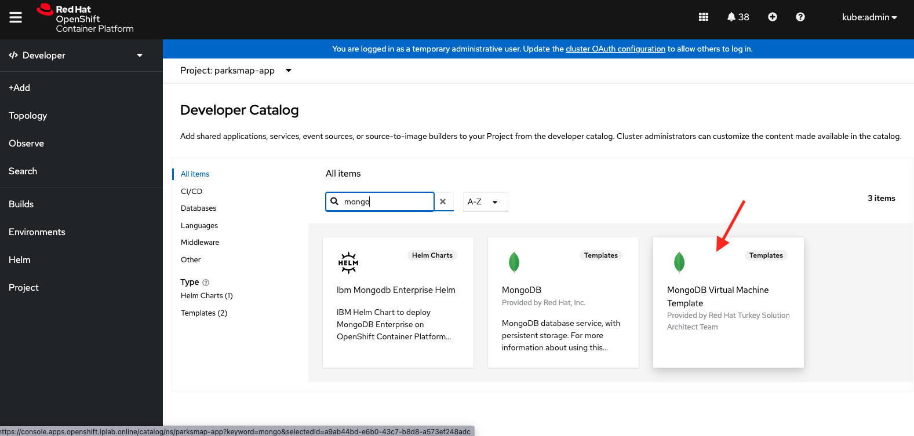
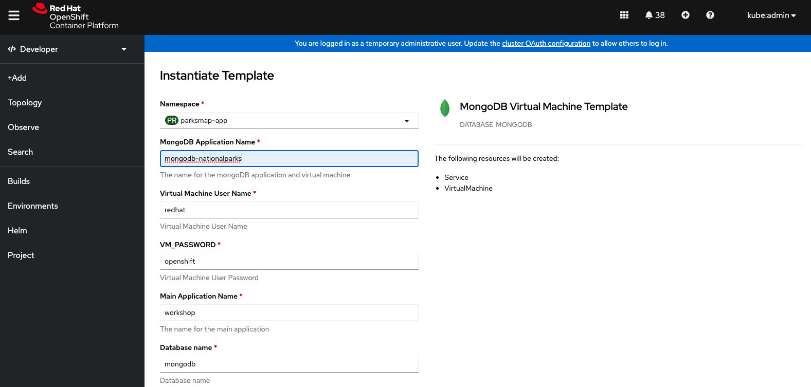
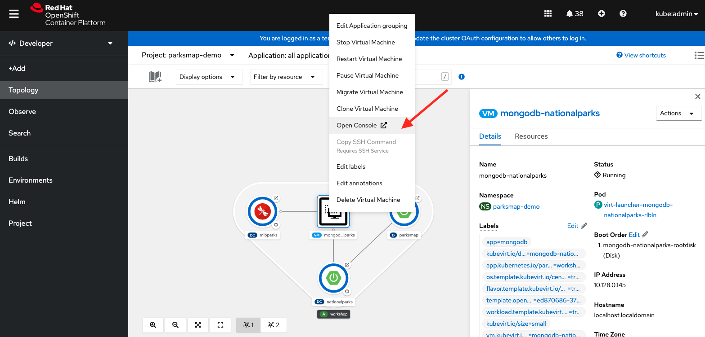
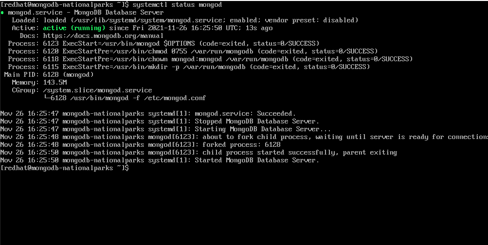
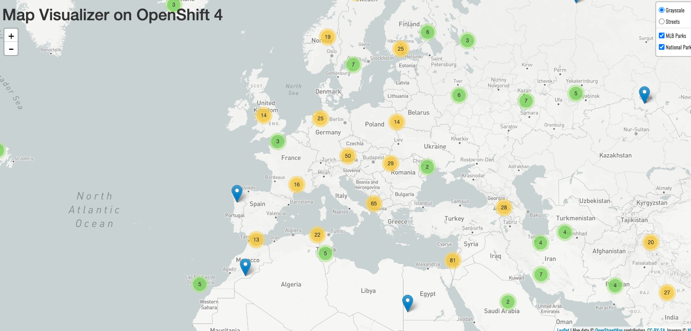

In this section we will deploy and connect a MongoDB database where the
`nationalparks` application will store the location information.

This time we are going to deploy the MongoDB application in a Virtual Machine 
by leveraging OpenShift Virtualization.   


### 1.  Search for the Virtual Machine Template


In this module we will create MongoDB from a *Template*, which contains all the necessary Kubernetes resources and configuration to deploy and run MongoDB in a VM which is based on Centos.


Please go back to the [Developer Console](http://console-openshift-console.%cluster_subdomain%/add/ns/%parksmap-project-namespace%) 

Ensure you are in the *%parksmap-project-namespace%* project. 


- From the left menu, click *+Add*. You will see a screen where you have multiple options to deploy application. 

- Then Click *All Services* and in the *Search* text box and enter *mongo*  to find the MongoDB VM template. 

 <br/>

  

<br/>

### 2. Instantiate the Virtual Machine Template

In order to instantiate the temaplate, first click on the `MongoDB Virtual Machine` template to open the popup menu 
and then click on the *Instantiate Template* button as you did when you deployed the parksmap application components.
This will open a dialog that will allow you to configure the template. This template allows you to configure the following parameters:

- *MongoDB Application Name*
- *Virtual Machine Username*
- *Virtual Machine User Password*
- *Database Name*
- *Database Username*
- *Database Admin Password*
  
Enter *mongodb-nationalparks* in  **MongoDB Application Name** field and leave other parameter values as-is.
 
 <br/>

  

 <br/>

Next click the blue *Create* button. 

You will be directed to the *Topology* page, where you should see the visualization for the `mongodb-nationalparks` virtual machine in the `workshop` application. 
This will make OpenShift to create both *VirtualMachine* and *Service* objects. `nationalparks` backend application will use this *mongodb-nationalparks service* to communicate with MongoDB.  

### 3. Verify the Database Service in Virtual Machine  

It will take some time MongoDB VM to start and initialize. You can check the status of VM in the Web Console by clicking on the VM  details in the Topology View or execute following command in the terminal 

```execute-1
oc get vm
```

Execute above command several times until you see VM is in **Running** status:

~~~bash
NAME                    AGE   STATUS     READY
mongodb-nationalparks   45s   Running    True
~~~

After MongoDB Virtual Machine started, open *Virtual Machine Console* as shown in the figure below 

 <br/>

  

 <br/>

Wait for the login prompt.

On the login screen, enter the following credentials:

~~~bash
  Login: %mongodb-vm-username%
  Password: %mongodb-vm-password%
~~~

Check whether *mongod* service is running by executing following:

```copy
systemctl status mongod
```

Please verify whether *mongod* service is up and running as shown in the figure below

 <br/>

  

 <br/>

### 4. Verify Nationalparks Application

Now that we have a database deployed, we can again visit the `nationalparks` web
service to query for data:


[http://nationalparks-%parksmap-project-namespace%.%cluster_subdomain%/ws/data/all](http://nationalparks-%parksmap-project-namespace%.%cluster_subdomain%/ws/data/all)

And the result?
~~~bash
[]
~~~

Where's the data? Think about the process you went through. You deployed the
application and then deployed the database. Nothing actually loaded anything
*INTO* the database, though.

The application provides an endpoint to do just that:

[http://nationalparks-%parksmap-project-namespace%.%cluster_subdomain%/ws/data/load](http://nationalparks-%parksmap-project-namespace%.%cluster_subdomain%/ws/data/load)

And the result?

~~~bash
Items inserted in database: 2893
~~~

If you then go back to `/ws/data/all` you will see tons of JSON data now.

If you check your browser now:

[http://parksmap-%parksmap-project-namespace%.%cluster_subdomain%](http://parksmap-%parksmap-project-namespace%.%cluster_subdomain%)

 You'll notice that the parks suddenly are showing up as below. 
 <br/> 

  

### 5. Understand the MongoDB Virtual Machine Template

As you've seen so far, the web console and the templates makes it very easy to deploy things onto
OpenShift. When we deploy the database virtual machine, we pass in some values for configuration.
These values are used to set the username, password, name of the database, etc... 

Let's have a look at the template definition. Execute the following command to find the template:

```execute-1
oc get templates -n openshift| grep mongodb-vm-template
```

This should list the MongoDB Virtual Machine Template we are looking for:

~~~bash
mongodb-vm-template                                                                                                                8 (all set)       2
~~~

Now let's check the template definition:

```execute-1
oc get template mongodb-vm-template -n openshift -o yaml |grep -A 31 cloudInitNoCloud
```

There are many details, but let's focus on the `cloudInitNoCloud` section. This is the part where put the instructions to initialize the Virtual Machine. 
~~~yaml
...

- cloudInitNoCloud:
  userData: |-
    #cloud-config
    user: ${VM_USER_NAME}
    password: ${VM_PASSWORD}
    chpasswd: { expire: False }
    yum_repos:
      mongodb-org-3.6:
        baseurl: https://repo.mongodb.org/yum/redhat/$releasever/mongodb-org/3.6/x86_64/
        enabled: true
        gpgcheck: true
        gpgkey: https://www.mongodb.org/static/pgp/server-3.6.asc
        name: MongoDB Repository
    packages:
      - bash-completion
      - mongodb-org
    runcmd:
      - systemctl daemon-reload
      - systemctl enable mongod.service
      - systemctl start mongod.service
      - >
        mongo admin --host localhost --eval "db.createUser({user: 'root', pwd: '${MONGODB_ADMIN_PASSWORD}', roles: [{role: 'root', db: 'admin'}]});"
      - >
        mongo admin --host localhost --eval "db.getSiblingDB('mongodb').createUser({user: '${MONGODB_USER}', pwd: '${MONGODB_PASSWORD}', roles: [{role: 'dbOwner', db: '${MONGODB_DATABASE}'}]});"
      - >
        sed -i -e 's/bindIp: 127.0.0.1/bindIp: 0.0.0.0/g' /etc/mongod.conf
      - >
        sed -i -e 's/^#security:/security:/g' /etc/mongod.conf
      - >
        sed -i -e '/^security:/a \  authorization: enabled' /etc/mongod.conf
      - systemctl restart mongod.service
name: cloudinitdisk

...
~~~

Let's check the VirtualMachine object now

```execute-1
 oc get vm mongodb-nationalparks -n %parksmap-project-namespace% -o yaml |grep -A 31 cloudInitNoCloud
```

When we instantiate the template, OpenShift replaces the parameters with the values provided :

~~~yaml
...
 - cloudInitNoCloud:
    userData: |-
      #cloud-config
      user: redhat
      password: openshift
      chpasswd: { expire: False }
      yum_repos:
        mongodb-org-3.6:
          baseurl: https://repo.mongodb.org/yum/redhat/$releasever/mongodb-org/3.6/x86_64/
          enabled: true
          gpgcheck: true
          gpgkey: https://www.mongodb.org/static/pgp/server-3.6.asc
          name: MongoDB Repository
      packages:
        - bash-completion
        - mongodb-org
      runcmd:
        - systemctl daemon-reload
        - systemctl enable mongod.service
        - systemctl start mongod.service
        - >
          mongo admin --host localhost --eval "db.createUser({user: 'root', pwd: 'mongodb', roles: [{role: 'root', db: 'admin'}]});"
        - >
          mongo admin --host localhost --eval "db.getSiblingDB('mongodb').createUser({user: 'mongodb', pwd: 'mongodb', roles: [{role: 'dbOwner', db: 'mongodb'}]});"
        - >
          sed -i -e 's/bindIp: 127.0.0.1/bindIp: 0.0.0.0/g' /etc/mongod.conf
        - >
          sed -i -e 's/^#security:/security:/g' /etc/mongod.conf
        - >
          sed -i -e '/^security:/a \  authorization: enabled' /etc/mongod.conf
        - systemctl restart mongod.service
  name: cloudinitdisk
...
~~~

OpenShift utilizes `cloud-init` which is a widely adopted project used for early initialization of a VM. Used by cloud providers such as AWS and GCP, `cloud-init` has established itself as the defacto method of providing startup scripts to VMs.

Cloud-init documentation can be found here: 
[https://cloudinit.readthedocs.io/en/latest/](https://cloudinit.readthedocs.io/en/latest/)

OpenShift Virtualization supports cloud-init's "NoCloud" and "ConfigDrive" datasources which involve injecting startup scripts into a VM instance through the use of an ephemeral disk. VMs with the cloud-init package installed will detect the ephemeral disk and execute custom userdata scripts at boot.

Other than cloud-init, OpenShift Virtualization also supports `SysPrep` whichan automation tool for Windows that automates Windows installation, setup, and custom software provisioning. 

So you can now automate your Windows virtual machine setup by uploading answer files in XML format in the Advanced → SysPrep section of the Create virtual machine from template wizard


