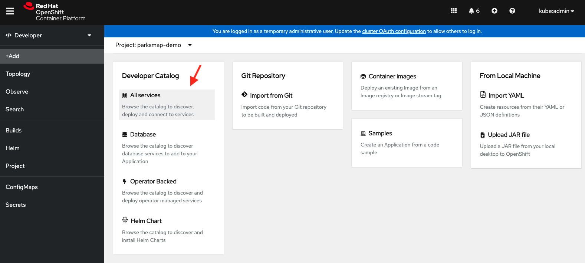
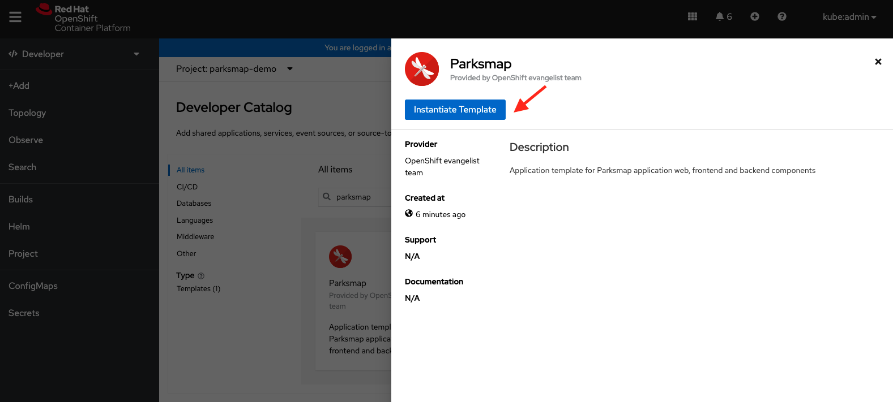

In this section we will deploy and connect a MongoDB database where the
`nationalparks` application will store the location information.

This time we are going to deploy the MongoDB application in a Virtual Machine 
by leveraging OpenShift Virtualization.   

## 1.  Search for the MongoDB Virtual Machine Template

Please go back to the [Web Console](http://console-openshift-console.{{cluster_subdomain}}/k8s/cluster/projects):

If you are in the in the Administrator perspective, switch to Developer 
perspective and go to the `{{PARKSMAP_NAMESPACE}}` project. 

In this module we will create MongoDB from a *Template*, which contains all the necessary Kubernetes 
resources and configuration to deploy and run MongoDB in a VM which is based on Centos.

From the left menu, click `+Add`. You will see a screen where you have 
multiple options to deploy application to OpenShift. Click `All Services` as shown below.

  

In the `Search` text box, enter *MongoDB* 
to find the application template. 

  

## 5. Instantiate the Application Template

Then click on the `Parksmap` template to open the popup menu 
and then click on the `Instantiate Template` button as shown below.

  

This will open a dialog that will allow you to configure the template. 
This template allows you to configure the following parameters:

- Parksmap Web Application Name
- Mlbparks Application Name
- Mlbparks MongoDB Application Name
- Nationalparks Application Name
- Nationalparks MongoDB Application Name

  

Next click the blue *Create* button without changing default parameters. 
You will be directed to the *Topology* page, where you should see 
the visualization for the `parksmap` deployment config in the `workshop` application. 
This will make OpenShift to create all Kubernetes resources to deploy 
the application which includes *Deployment*, *Service*, and *Route*.

## 5. Check the Application
