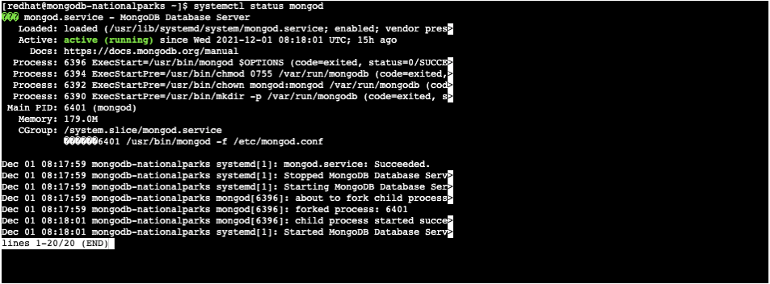
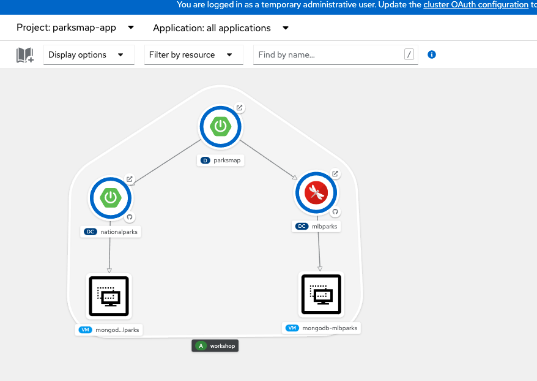
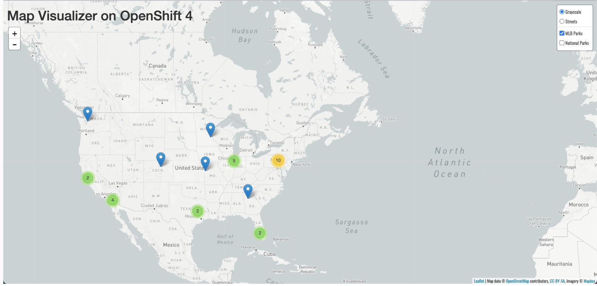

In this section we will deploy and connect the MongoDB database where the
`mlbparks` application which will store the  location of Major League Baseball stadiums.

This time we are going to deploy the MongoDB Virtual Machine with using command line.

### 1. Creating MongoDB Virtual Machine

If you are in the in the Administrator perspective

Switch to *%parksmap-project-namespace%* project  first by executing following command:

```execute
oc project %parksmap-project-namespace%
```

And then run the following command to instantiate the template:

```execute
oc process mongodb-vm-template -p MONGODB_APPLICATION_NAME=mongodb-mlbparks -n openshift|oc create -f -
```

### 2. Verify the Database Service in Virtual Machine  

It will take some time MongoDB VM to start and initialize. You can check the status of VM in the Web Console by clicking on the VM  details in the Topology View or execute following command in the terminal 

```execute
oc get vm
```

~~~bash
NAME                    AGE   STATUS     READY
mongodb-nationalparks   45s   Running    True
~~~

After MongoDB Virtual Machine started, 

Open *Virtual Machine Console* as shown in the figure below 

Switch to *Serial Console* and wait for the login prompt.

On the login screen, enter the following credentials:

~~~bash
  Login: %mongodb-vm-username%
  Password: %mongodb-vm-password%
~~~

Check whether *mongod* service is running by executing following:

```execute
systemctl status mongod
```

Please verify whether *mongod* service is up and running as shown in the figure below
 <br/>

  

 <br/>

### 3. Verify Mlbparks Application

If you go back to Developer Console now, you should able to see all `parksmap application` components including the MongoDB Virtual Machines.
 
 <br/>

  


Now that we have the database deployed for `mlbparks` , we can again visit the mlbparks web
service to query for data:


[Mlbparks Data All](http://mlbparks-%parksmap-project-namespace%.%cluster_subdomain%/ws/data/all)

And the result is empty as expected.

~~~bash
[]
~~~

So to load the data go to following end point:

[Mlbparks Data Load](http://mlbparks-%parksmap-project-namespace%.%cluster_subdomain%/ws/data/load)

Now you should see the

~~~bash
Items inserted in database: 30
~~~

If you check parksmap application in your browser you should be able to see the stadium locations in United States as well:

[Parksmap](http://parksmap-%parksmap-project-namespace%.%cluster_subdomain%)

 <br/> 

  


