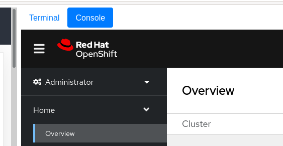

#### Command Line Interface

OpenShift includes a feature-rich web console with both an Administrator and a Developer perspective. In addition to the web console, OpenShift includes command line tools to provide users with a comprehensive  interface to work with applications deployed to the platform.  The `oc` command line tool is an executable built on-top of `kubectl` and is  written in the Go programming language. It is available for the following operating systems:

* Microsoft Windows
* MacOS
* Linux

This lab environment has the `oc` command line tool installed, and your lab user is already logged in to the OpenShift cluster with administrative access - you're not sharing this cluster with anyone else. Issue the following command to see help information for the CLI:

```execute-1
oc help
```

#### Using a Project

Projects are a top level concept to help you organise your resources. An OpenShift project allows a community of users (or a user) to organise and manage their content in isolation from other communities. Each project has its own resources, policies (who can/cannot perform actions), and constraints (quotas and limits on resources, etc). Projects act as a "wrapper" around all the application services and endpoints you, or your teams, are using for your work.

#### Web Console

OpenShift ships with a web-based console that will allow users to perform various tasks via a web browser.

From within the lab guide window you'll see a button in the middle at the top that allows you to switch between the terminal and console options. Select the console and you should see the OpenShift web console, you'll already be logged in:




However if you want to open up a dedicated tab/window for the Web Console you can do so, simple click on this link: [Web Console](http://console-openshift-console.%cluster_subdomain%/k8s/cluster/projects). To login, you need to first get the *kubeadmin-password*. You can get it from the OpenShift installation directory on the bastion node, the machine that is used to perform the installation of OpenShift in your dedicated environment.

First SSH to bastion node:

```execute-1
ssh %bastion-username%@%bastion-host%
```

When you see the prompt enter **%bastion-password%** as password

Then you can execute following to get the password:

```execute-1
echo $(cat %kubeadmin-password-file%)
```

Note the password (or copy it) and exit the ssh session:

```execute-1
exit
```

> **NOTE**: Make sure that you exit from this session before proceeding!

```execute-1
oc whoami
```
The above output should show "**system:serviceaccount:workbook:cnv**", if it doesn't or it shows "**system:admin**" you've not yet disconnected from the session.

On Web Console login screen, enter the following credentials:

- Username: *kubeadmin*
- Password: (the password you previously copied)

The first time you access the web console, you will most likely be in the *Administrator* perspective. At the top of the left navigation menu, you can toggle between the Administrator perspective and the Developer perspective.

Select **Developer** to switch to the Developer perspective. Once the Developer perspective loads, you should select the **Topology** view from the menu on the left-hand side. Right now, there are no applications or components to view, but once you begin working on the lab, you'll be able to visualise and interact with the components in your application here.

We will be using a mix of command line tooling and the web console for the labs. Select "Validate" below to continue with the validation of the environment and to become more familiar with OpenShift and its core functionality.