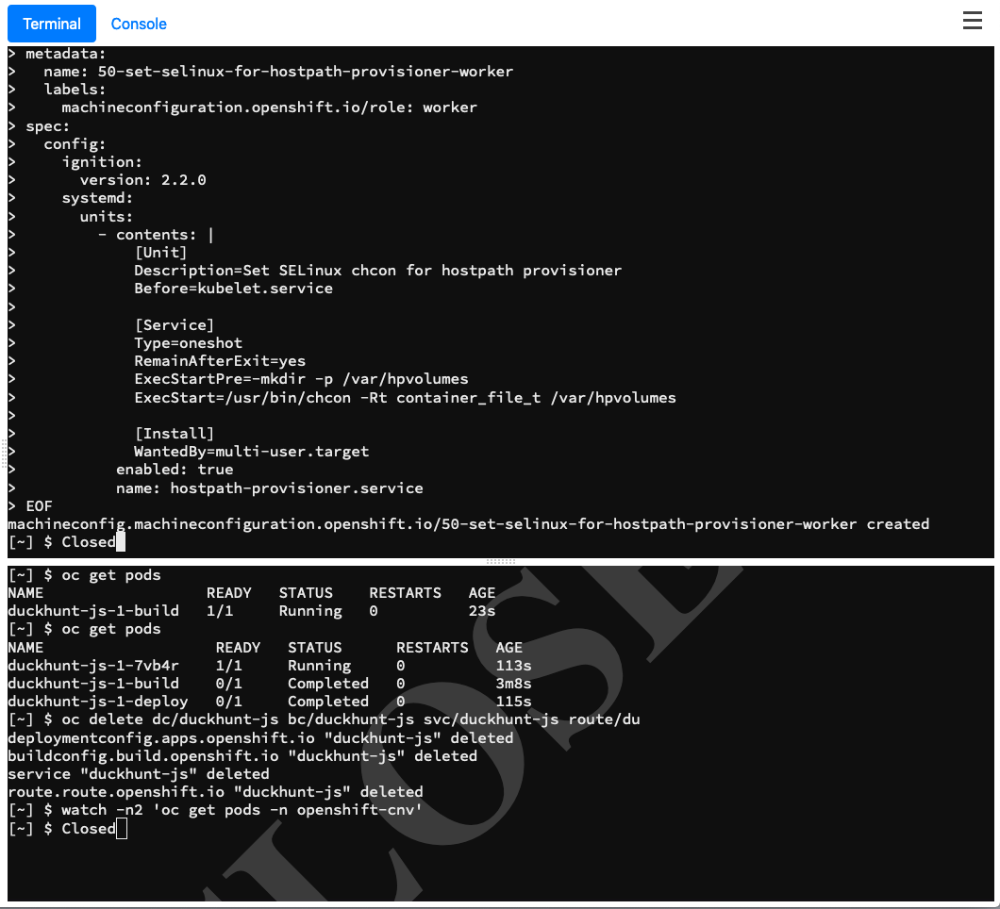
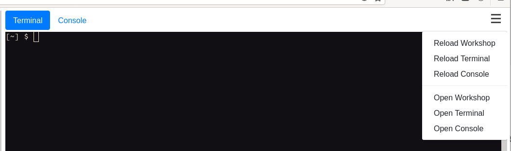

## Bonus Lab: Hostpath Storage 

Now let's create a second storage type based on `hostpath` storage, which utilises the disk on the hypervisors (workers) to provide storage space for us, useful when you want to leverage fast storage locally and don't need to rely on shared storage - the data here is essentially ephemeral and limits certain functionality such as live migration. As we're not using a pre-configured shared storage pool for this we need to ask OpenShift's `MachineConfigOperator` to do some work for us directly on our worker nodes.

Run the following in the terminal window - it will generate a new `MachineConfig` that the cluster will enact, recognising that we only match on the worker nodes (`machineconfiguration.openshift.io/role: worker`):


```execute-1 
cat << EOF | oc apply -f -
apiVersion: machineconfiguration.openshift.io/v1
kind: MachineConfig
metadata:
  name: 50-set-selinux-for-hostpath-provisioner-worker
  labels:
    machineconfiguration.openshift.io/role: worker
spec:
  config:
    ignition:
      version: 2.2.0
    systemd:
      units:
        - contents: |
            [Unit]
            Description=Set SELinux chcon for hostpath provisioner
            Before=kubelet.service

            [Service]
            Type=oneshot
            RemainAfterExit=yes
            ExecStartPre=-mkdir -p /var/hpvolumes
            ExecStart=/usr/bin/chcon -Rt container_file_t /var/hpvolumes

            [Install]
            WantedBy=multi-user.target
          enabled: true
          name: hostpath-provisioner.service
EOF
```

Then wait for `MachineConfig` is created:

~~~bash
machineconfig.machineconfiguration.openshift.io/50-set-selinux-for-hostpath-provisioner-worker created
~~~

This deploys a new `systemd` unit file on the worker nodes to create a new directory at `/var/hpvolumes` and relabels it with the correct SELinux contexts at boot-time, ensuring that OpenShift can leverage that directory for local storage. We do this via a `MachineConfig` as the CoreOS machine is immutable. You should first start to witness OpenShift starting to drain the worker nodes and disable scheduling on them so the nodes can be rebooted safely, although it's likely that if you're not quick enough to issue this command you may temporarily lose access to your cluster:


```execute-1 
oc get mcp
```
~~~bash
NAME     CONFIG                                             UPDATED   UPDATING   DEGRADED   MACHINECOUNT   READYMACHINECOUNT   UPDATEDMACHINECOUNT   DEGRADEDMACHINECOUNT   AGE
master   rendered-master-9d055df78d00fda1c014f7247c4270b2   True      False      False      3              3                   3                     0                      95m
worker   rendered-worker-08d4857819910827ea841dcf71bc4a0a   False     True       False      3              0                   0                     0                      95m
~~~

```execute-1 
oc get nodes
```

~~~bash
ocp4-master1.%node-network-domain%   Ready                      master   95m   v1.22.0-rc.0+a44d0f0
ocp4-master2.%node-network-domain%   Ready                      master   96m   v1.22.0-rc.0+a44d0f0
ocp4-master3.%node-network-domain%   Ready                      master   95m   v1.22.0-rc.0+a44d0f0
ocp4-worker1.%node-network-domain%   Ready,SchedulingDisabled   worker   76m   v1.22.0-rc.0+a44d0f0
ocp4-worker2.%node-network-domain%   Ready                      worker   76m   v1.22.0-rc.0+a44d0f0
ocp4-worker3.%node-network-domain%   Ready                      worker   76m   v1.22.0-rc.0+a44d0f0
~~~


> **NOTE**: This will take a few minutes to reflect on the cluster, and causes the worker nodes to reboot (where the routers are running). You'll witness a disruption on the lab guide functionality where you will see the consoles hang and/or display a "Closed" image. In some cases we have needed to refresh the entire browser.
>
> 

> It should automatically reconnect but if it doesn't, you can try reloading the terminal by clicking the three bars in the top right hand corner:




When you're able to issue commands again, make sure you're in the correct namespace again:

```execute-1 
oc project default
```

And result:

~~~bash
Now using project "default" on server "https://172.30.0.1:443".
~~~

Now wait for the following command to return `True` as it indicates when the `MachineConfigPool`'s worker has been updated with the latest `MachineConfig` requested:

```execute-1 
oc get machineconfigpool worker -o=jsonpath="{.status.conditions[?(@.type=='Updated')].status}{\"\n\"}"
```

You see *True* as output

~~~bash
True
~~~

Now we can set the HostPathProvisioner configuration itself, i.e. telling the operator what path to actually use - the systemd file we just applied merely ensures that the directory is present and has the correct SELinux labels applied to it:

```execute-1 
cat << EOF | oc apply -f -
apiVersion: hostpathprovisioner.kubevirt.io/v1beta1
kind: HostPathProvisioner
metadata:
  name: hostpath-provisioner
spec:
  imagePullPolicy: IfNotPresent
  pathConfig:
    path: "/var/hpvolumes"
    useNamingPrefix: false
  workload:
    nodeSelector:
      kubernetes.io/os: linux
EOF
```

Check the output whether the HostPathProvisioner is created:

~~~bash
hostpathprovisioner.hostpathprovisioner.kubevirt.io/hostpath-provisioner created
~~~

When you've applied this config, an additional pod will be spawned on each of the worker nodes; this pod is responsible for managing the hostpath access on the respective host; 

```execute-1 
oc get pods -n openshift-cnv | grep hostpath
```

note the shorter age in the output below:

~~~bash 
hostpath-provisioner-fxwnc                             1/1     Running   0               16s
hostpath-provisioner-operator-5c9cdb75d-crwv8          1/1     Running   0               14m
hostpath-provisioner-t9g4g                             1/1     Running   0               16s
hostpath-provisioner-twb46                             1/1     Running   0               16s
~~~

We're now ready to configure a new `StorageClass` for the HostPath based storage:


```execute-1 
cat << EOF | oc apply -f -
apiVersion: storage.k8s.io/v1
kind: StorageClass
metadata:
  name: hostpath-provisioner
provisioner: kubevirt.io/hostpath-provisioner
reclaimPolicy: Delete
volumeBindingMode: WaitForFirstConsumer
EOF
```

You should see following output:

~~~bash
storageclass.storage.k8s.io/hostpath-provisioner created
~~~

You'll note that this storage class **does** have a provisioner, and therefore like the OCS provisioner it can create persistent volumes dynamically when a claim is submitted by the user. Let's validate that by creating a new hostpath based PVC that contains the same image like before (note the `cdi.kubevirt.io/storage.import.endpoint` annotation), and checking that it creates the associated PV:

```execute-1 
cat << EOF | oc apply -f -
apiVersion: v1
kind: PersistentVolumeClaim
metadata:
  name: "rhel8-hostpath"
  labels:
    app: containerized-data-importer
  annotations:
    cdi.kubevirt.io/storage.import.endpoint: "http://192.168.123.100:81/rhel8-kvm.img"
    volume.kubernetes.io/selected-node: ocp4-worker2.%node-network-domain%                       
spec:
  volumeMode: Filesystem
  storageClassName: hostpath-provisioner
  accessModes:
  - ReadWriteOnce
  resources:
    requests:
      storage: 40Gi
EOF
```

PersistentVolumeClaim should be created:

~~~bash
persistentvolumeclaim/rhel8-hostpath created
~~~
Now check that it successfully binds 

```execute-1 
oc get pvc
```
You should have two here, one for hostpath and the one previously created within OCS:

~~~bash
NAME             STATUS   VOLUME                                     CAPACITY   ACCESS MODES   STORAGECLASS                  AGE
rhel8-hostpath   Bound    pvc-0f3ff50d-12b1-4ad6-8beb-be742a6e674a   79Gi       RWO            hostpath-provisioner          85s
rhel8-ocs        Bound    pvc-1a4ea2c5-937c-486d-932c-b2b7d161ec0e   40Gi       RWX            ocs-storagecluster-ceph-rbd   33m
~~~

> **NOTE**: The capacity displayed above lists the available space on the host, not the actual size of the persistent volume when being used.

Check again the pods:

```execute-1 
oc get pods
```

As we're using the containerised data importer tool, we expect the importer image to run again:


~~~bash
NAME                      READY   STATUS    RESTARTS   AGE
importer-rhel8-hostpath   1/1     Running   0          88s
~~~

> **NOTE**: You can watch the output of this importer pod with `$ oc logs -f importer-rhel8-hostpath`.  Didn't see any pods? You likely just missed it. To be sure the PV was created continue to the next command.


Let's look more closely at our new PV (get the ID from the previous command `oc get pvc`). Describe the new hostpath PV, noting that you'll need to adapt for the `uuid` in your environment:

```copy 
oc describe pv/pvc-0f3ff50d-12b1-4ad6-8beb-be742a6e674a
```

Then examine the below:

~~~yaml
Name:              pvc-0f3ff50d-12b1-4ad6-8beb-be742a6e674a
Labels:            <none>
Annotations:       hostPathProvisionerIdentity: kubevirt.io/hostpath-provisioner
                   kubevirt.io/provisionOnNode: ocp4-worker2.%node-network-domain%
                   pv.kubernetes.io/provisioned-by: kubevirt.io/hostpath-provisioner
Finalizers:        [kubernetes.io/pv-protection]
StorageClass:      hostpath-provisioner
Status:            Bound
Claim:             default/rhel8-hostpath
Reclaim Policy:    Delete
Access Modes:      RWO
VolumeMode:        Filesystem
Capacity:          79Gi
Node Affinity:     
  Required Terms:  
    Term 0:        kubernetes.io/hostname in [ocp4-worker2.%node-network-domain%]
Message:           
Source:
    Type:          HostPath (bare host directory volume)
    Path:          /var/hpvolumes/pvc-0f3ff50d-12b1-4ad6-8beb-be742a6e674a
    HostPathType:  
Events:            <none>
~~~

There's a few important details here worth noting, namely the `kubevirt.io/provisionOnNode` annotation, and the path of the volume on that node. In the example above you can see that the volume was provisioned on *ocp4-worker2.%node-network-domain%*, the second of our three worker nodes (in your environment it may have been scheduled onto a different worker). 

Let's look more closely to verify that this truly has been created for us on the designated worker.

> **NOTE**: You may have to substitute `ocp4-worker1` with `ocp4-worker2` if your hostpath volume was scheduled to worker2. You'll need to also match the UUID to the one that was generated by your PVC. 


```execute-1 
oc debug node/ocp4-worker2.%node-network-domain%
```

Wait a while to see command prompt:

~~~bash
Starting pod/ocp4-worker2aioexamplecom-debug ...
To use host binaries, run `chroot /host`
Pod IP: 192.168.123.105
If you don't see a command prompt, try pressing enter.
~~~

```execute-1
chroot /host
```

Now you are in host root directory in `ocp4-worker2`:

Then execute 

```copy
ls -l /var/hpvolumes/pvc-0f3ff50d-12b1-4ad6-8beb-be742a6e674a/
```


Expect to see a similar output as below

~~~bash
total 5784756                                                                                           
-rwxr-xr-x. 1 root root 40587231232 Nov  8 08:54 disk.img
~~~

Check the file with the below command:

```copy
file /var/hpvolumes/pvc-0f3ff50d-12b1-4ad6-8beb-be742a6e674a/disk.img
/var/hpvolumes/pvc-0f3ff50d-12b1-4ad6-8beb-be742a6e674a/disk.img:
```

Then expect to see a similar output as below:

~~~bash
/var/hpvolumes/pvc-0f3ff50d-12b1-4ad6-8beb-be742a6e674a/disk.img: DOS/MBR boot sector
~~~

Then exit from the debug pod:

```execute-1
exit
```

```execute-1
exit
```

Make sure that you've executed the two `exit` commands above - we need to make sure that you're back to the right shell before continuing, and aren't still inside of the debug pod. Congratulations - we've verified that our storage is setup correctly and that we have two storage options - OpenShift Data Foundation (OCS) and HostPath storage.

```execute-1
oc whoami
```


~~~bash
system:serviceaccount:workbook:cnv
~~~
