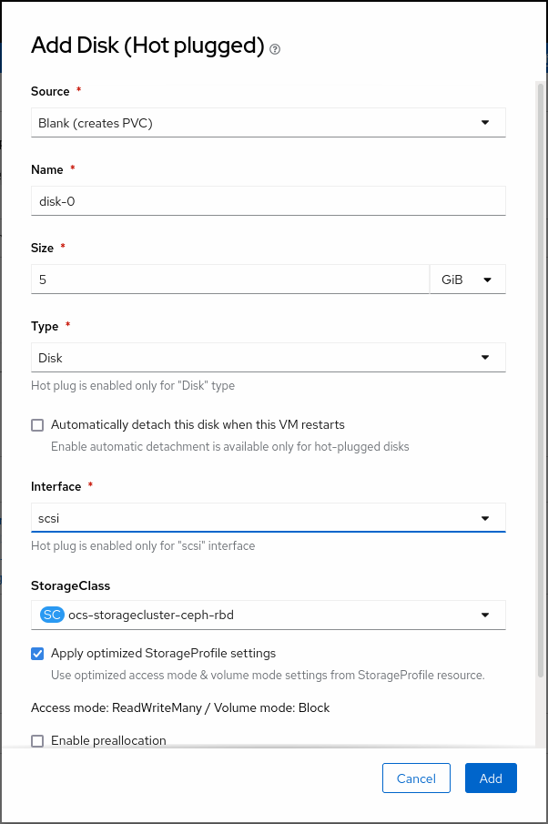
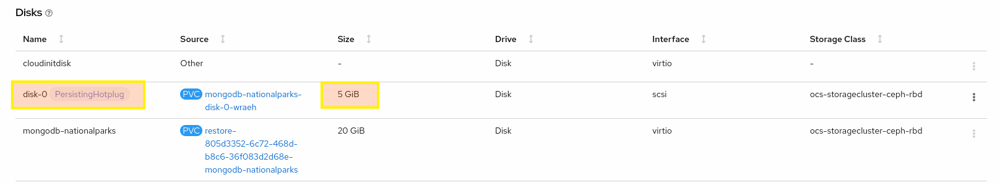
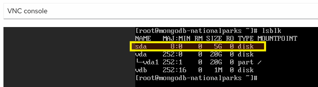
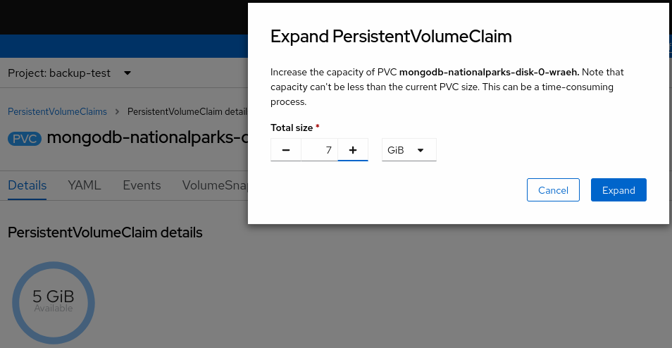
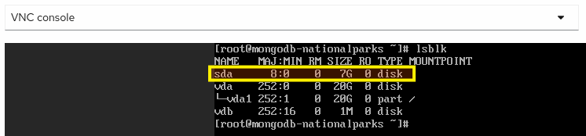
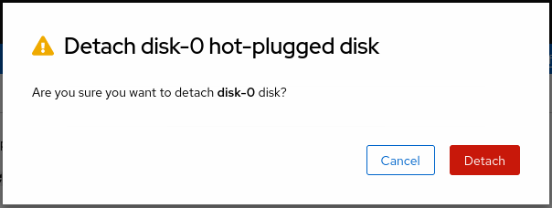
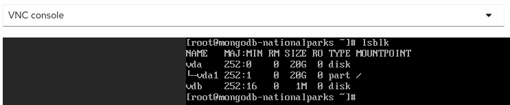

### Background: Hot-plugging virtual disks
It is expected to have **Dynamic Reconfiguration** capabilities for VMs today, such as CPU/Memory/Storage/Network hot-plug/hot-unplug.
Although these capabilities have been around for the traditional virtualization platforms, it is a particularly challenging feature to implement in a **Kubernetes** platform because of the kubernetes principle of **immutable Pods**, where once deployed they are never modified. If something needs to be changed, you never do so directly on the Pod. Instead, you’ll build and deploy a new one that have all your needed changes baked in.

OpenShift Virtualization strives to have these dynamic reconfiguration capabilities for VMs although it's a kubernetes-based platform. In 4.9 release, Hot-plugging virtual disks to a running virtual machine is supported as a Technology Preview feature, so as a VM owner, you are able to attach and detach storage on demand.

### Exercise: Hot-plugging a virtual disk using the web console
Hot-plug and hot-unplug virtual disks when you want to add or remove them without stopping your virtual machine or virtual machine instance. This capability is helpful when you need to add storage to a running virtual machine without incurring down-time. When you hot-plug a virtual disk, you attach a virtual disk to a virtual machine instance while the virtual machine is running. When you hot-unplug a virtual disk, you detach a virtual disk from a virtual machine instance while the virtual machine is running. Only data volumes and persistent volume claims (PVCs) can be hot-plugged and hot-unplugged. You cannot hot-plug or hot-unplug container disks.

In this exercise, let's attach a new 5G disk to mongodb database vm by using the web console.
<table>
  <tr>
    <td>

1. Click **Workloads** → **Virtualization** from the side menu.
   
2. Click the **Virtual Machines** tab.
   
3. Select `mongodb-nationalparks` virtual machine to open its **Overview** screen.

4. On the **Disks** tab, click **Add Disk**.

5. In the **Add Disk** window, fill in the information for the virtual disk that you want to hot-plug.

6. Click **Add**.
   </td>
   <td></td>
  </tr>
 </table>

Once you click Add to attach new disk, a new vm disk is automatically provisioned using the selected storage class, which is ceph-rbd in this exercise, and attached to the running virtual machine. You can see the new disk in the Disks tab of the virtual machine.

</td>

To verify if the new 5G disk is recognized and ready to use by the guest operating system, let's connect the console of our virtual machine and list block devices.

1. Click **Workloads** → **Virtualization** from the side menu.
   
2. Click the **Virtual Machines** tab.
   
3. Select `mongodb-nationalparks` virtual machine to open its **Overview** screen.

4. Navigate to the "**Console**" tab. You'll be able to login with "**centos/redhat**", noting that you may have to click on the console window for it to capture your input.

5. Once you're in the virtual machine, run the lsblk command to list block devices recognized by the operating system.
~~~bash
sudo lsblk
~~~
</td>

### Exercise: Expand the VM's disk
OpenShift allows users to easily resize an existing PersistentVolumeClaim (PVC) objects. You no longer have to manually interact with the storage backend or delete and recreate PV and PVC objects to increase the size of a volume. Shrinking persistent volumes is not supported.

In this exercise, let's resize our hot-plugged 5G disk to 7G by using the web console.
<table>
  <tr>
    <td>

1. Click **Workloads** → **Virtualization** from the side menu.
   
2. Click the **Virtual Machines** tab.
   
3. Select `mongodb-nationalparks` virtual machine to open its **Overview** screen.

4. On the **Disks** tab, click the **PVC name** of the `PersistingHotplug` disk.

5. In the **PersistentVolumeClaims** window, click **Actions** → **Expand PVC**

6. In the **Expand PersistentVolumeClaim** pop-up window, set the **Total Size** as **7 GiB**

7. Click **Expand**.
   
   </td>
   <td></td>
  </tr>
 </table>

Currently, guest operating systems are not noticed automatically when you expand one of VM disks as we did in this exercise. The feature to automatically notify guest operating systems has already been implemented and merged into the upstream KubeVirt project (https://github.com/kubevirt/kubevirt/pull/5981), and is expected to be added into a future OpenShift Virtualization release.
To verify if the guest operating system has recognized the disk expansion, let's connect the console of our virtual machine and list block devices again.
Size of the hot-plugged disk should still listed as 5G instead of 7G.

1. Click **Workloads** → **Virtualization** from the side menu.
   
2. Click the **Virtual Machines** tab.
   
3. Select `mongodb-nationalparks` virtual machine to open its **Overview** screen.

4. Navigate to the "**Console**" tab. You'll be able to login with "**centos/redhat**", noting that you may have to click on the console window for it to capture your input.

5. Once you're in the virtual machine, run the lsblk command to list block devices recognized by the operating system.
~~~bash
sudo lsblk
~~~
</td>

OpenShift Virtualization creates one pod for each running virtual machine. This pod's primary container runs the virt-launcher. The main purpose of the virt-launcher Pod is to provide the cgroups and namespaces which will be used to host the VM process.
An instance of `libvirtd` is present in every VM pod. virt-launcher uses libvirtd to manage the life-cycle of the VM process.
libvirt is an open-source API, daemon and management tool for managing platform virtualization including KVM, `virsh` is the most popular command line interface to interact with libvirt daemon `libvirtd`. In other words, you can manage KVM VM’s using `virsh` command line interface.
To send a disk size change event to guest operating system, we can execute `virsh blockresize` command inside the virt-launcher pod of the virtual machine.
Let's connect the terminal of `virt-launcher` pod of our virtual machine and execute `virsh blockresize` command to notify guest operating system so that it can recognize the disk size expansion.

1. Click **Workloads** → **Pods** from the side menu.
   
2. Select the Pod whose name starts with `virt-launcher-mongodb-nationalparks` its **Overview** screen.

3. Navigate to the "**Terminal**" tab. You may have to click on the console window for it to capture your input.

4. Once you're in the Pod's terminal, run the following commands to list block devices attached to the running virtual machine.

First list the running virtual machine and note it's Id.
~~~bash
virsh list
~~~
~~~bash
 Id   Name                                State
---------------------------------------------------
 1    backup-test_mongodb-nationalparks   running
~~~
Now list the block devices attached to the running virtual machine with `virsh domblklist` command.
~~~bash
virsh domblklist 1
~~~
~~~bash
 Target   Source
-----------------------------------------------------------------------------------------------------------
 vda      /dev/mongodb-nationalparks
 vdb      /var/run/kubevirt-ephemeral-disks/cloud-init-data/backup-test/mongodb-nationalparks/noCloud.iso
 sda      /var/run/kubevirt/hotplug-disks/disk-0
~~~
Name of the disk we have expanded should be disk-0. You can check the name of the disk on the **Disks** tab of the virtual machine if you are not sure.
Once you identify the disk which is `sda` in our example, then run the `virsh blockresize` command to notify the guest operating system that the disk is expanded to 7 GB.
~~~bash
virsh blockresize 1 sda 7g
~~~
~~~bash
Block device 'sda' is resized
~~~
After executing the `virsh blockresize` command, verify by listing block devices recognized by the operating system again in the virtual machine console.
~~~bash
sudo lsblk
~~~
</td>

### Exercise: Hot-unplugging a virtual disk using the web console
Hot-unplug virtual disks when you want to remove them without stopping your virtual machine or virtual machine instance. This capability is helpful when you need to remove storage from a running virtual machine without incurring down-time. When you hot-unplug a virtual disk, you detach a virtual disk from a virtual machine instance while the virtual machine is running. Only data volumes and persistent volume claims (PVCs) can be hot-unplugged.

In this exercise, let's detach the disk that we have hot-plugged in the previous exercise from our mongodb database vm by using the web console.
<table>
  <tr>
    <td>

1. Click **Workloads** → **Virtualization** from the side menu.
   
2. Click the **Virtual Machines** tab.
   
3. Select `mongodb-nationalparks` virtual machine to open its **Overview** screen.

4. Click the **Disks** tab. The page displays a list of disks attached to the virtual machine.

5. Click the Options menu  of the **disk** named `disk-0` which is marked as `PersistingHotplug`

6. Click **Delete**.
   
7. In the confirmation pop-up window, click **Detach** to hot-unplug the disk.
   </td>
   <td></td>
  </tr>
 </table>

Once you click **Detach** to hot-unplug the disk it's  detached from the running virtual machine and guest operating system automatically recognizes the event. 
To verify if the 7G disk removal is recognized by the guest operating system, let's connect the console of our virtual machine and list block devices once again. The disk should no longer be listed by the guest operating system.

1. Click **Workloads** → **Virtualization** from the side menu.
   
2. Click the **Virtual Machines** tab.
   
3. Select `mongodb-nationalparks` virtual machine to open its **Overview** screen.

4. Navigate to the "**Console**" tab. You'll be able to login with "**centos/redhat**", noting that you may have to click on the console window for it to capture your input.

5. Once you're in the virtual machine, run the lsblk command to list block devices recognized by the operating system.
~~~bash
sudo lsblk
~~~
</td>

That's it for hot-plugging and expanding virtual disks - we've hot-plugged a new 5GB disk to our mongodb database virtual machine using OpenShift web console, expanded its size to 7GB and finally hot-unplugged it from our virtual machine.
=======