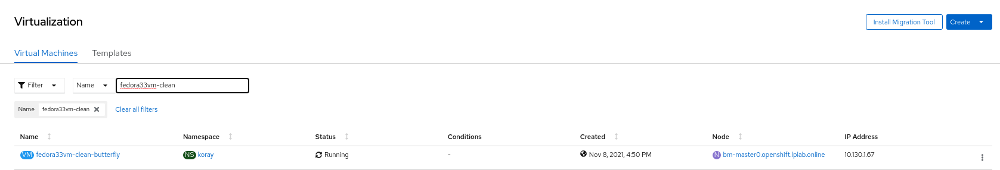

Live Migration is the process of moving an instance from one node in a cluster to another without interruption. This process can be manual or automatic. This depends if the `evictionStrategy` strategy is set to `LiveMigrate` and the underlying node is placed into maintenance. 

Live migration is an administrative function in OpenShift Virtualization. While the action is visible to all users, only admins can initiate a migration. Migration limits and timeouts are managed via the `kubevirt-config` `configmap`. For more details about limits see the [documentation](https://access.redhat.com/documentation/en-us/openshift_container_platform/4.3/html-single/container-native_virtualization/index#cnv-live-migration-limits-ref_cnv-live-migration-limits).

In our lab we only need to have only one VM running. Let's remove the hostpath-based VM, as this cannot be live migrated anyway, as it's utilising hypervisor based storage and is therefore RWO (read-write once) by definition. Our OCS-based virtual machine is using shared-storage on Ceph, and therefore should support live migration.

~~~bash
$ oc delete vm/rhel8-server-hostpath
virtualmachine.kubevirt.io "rhel8-server-hostpath" deleted
~~~

We should only have the one VM running now-

~~~bash
$ oc get vmi
NAME               AGE   PHASE     IP               NODENAME                       READY
rhel8-server-ocs   45h   Running   192.168.123.64   ocp4-worker3.aio.example.com   True
~~~

> **NOTE**: In OpenShift Virtualization, the "Virtual Machine" object can be thought of as the virtual machine "source" that virtual machine instances are created from. A "Virtual Machine Instance" is the actual running instance of the virtual machine. The instance is the object you work with that contains IP, networking, and workloads, etc. That's why we delete a VM, and list VMI's.

In this example we can see the `rhel8-server-ocs` instance is on `ocp4-worker3.aio.example.com`. As you may recall we deployed this instance with the `LiveMigrate` `evictionStrategy` strategy but you can also review an instance with `oc describe` to ensure it is enabled.

~~~bash
$ oc describe vmi rhel8-server-ocs | egrep -i '(eviction|migration)'
(...)
  Eviction Strategy:  LiveMigrate
  Migration Method:  LiveMigration
~~~

The easiest way to initiate a migration is to create an `VirtualMachineInstanceMigration` object in the cluster directly against the `vmi` we want to migrate (this can also be conducted via the OpenShift console if we like, and we'll take a look at it in a later lab section). But wait! Once we create this object it will trigger the migration, so first, let's review what it looks like:

~~~
apiVersion: kubevirt.io/v1alpha3
kind: VirtualMachineInstanceMigration
metadata:
  name: migration-job
spec:
  vmiName: rhel8-server-ocs
~~~

It's really quite simple, we create a `VirtualMachineInstanceMigration` object and reference the `LiveMigratable ` instance we want to migrate: `rhel8-server-ocs`.  Let's apply this configuration:

~~~bash
$ cat << EOF | oc apply -f -
apiVersion: kubevirt.io/v1alpha3
kind: VirtualMachineInstanceMigration
metadata:
  name: migration-job
spec:
  vmiName: rhel8-server-ocs
EOF

virtualmachineinstancemigration.kubevirt.io/migration-job created
~~~

Now let's watch the migration job in action. First it will show `phase: Scheduling` 

~~~bash
$ watch -n1 oc get virtualmachineinstancemigration/migration-job -o yaml

Every 1.0s: oc get virtualmachineinstancemigration/migration-job -o yaml                 Fri Mar 20 00:33:35 2020

apiVersion: kubevirt.io/v1alpha3
kind: VirtualMachineInstanceMigration
(...)
spec:
  vmiName: rhel8-server-ocs
status:
  phase: Scheduling                                  <----------- Here you can see it's scheduling
~~~

And then move to `phase: TargetReady` and onto`phase: Succeeded`:

~~~bash
Every 1.0s: oc get virtualmachineinstancemigration/migration-job -o yaml                 Fri Mar 20 00:33:43 2020

apiVersion: kubevirt.io/v1alpha3
kind: VirtualMachineInstanceMigration
(...)
spec:
  vmiName: rhel8-server-ocs
status:
  phase: Succeeded                                  <----------- Now it has finished the migration
~~~

Finally view the `vmi` object and you can see the new underlying host (was *ocp4-worker3*, now it's *ocp4-worker1*); your environment may have different source and destination hosts, depending on where `rhel8-server-ocs` was initially scheduled.

~~~bash
$ oc get vmi
NAME               AGE   PHASE     IP               NODENAME                       READY
rhel8-server-ocs   45h   Running   192.168.123.64   ocp4-worker1.aio.example.com   True 
~~~

As you can see Live Migration in OpenShift Virtualization is quite easy. If you have time, try some other examples. Perhaps start a ping and migrate the machine back. Do you see anything in the ping to indicate the process?

> **NOTE**: If you try and run the same migration job it will report `unchanged`. To run a new job, run the same example as above, but change the job name in the metadata section to something like `name: migration-job2`

Also, rerun the `oc describe vmi rhel8-server-ocs` after running a few migrations. You'll see the object is updated with details of the migrations, including source and target:

~~~bash
$ oc describe vmi rhel8-server-ocs
(...)
  Migration Method:                  LiveMigration
  Migration State:
    Completed:        true
    End Timestamp:    2021-11-10T11:39:20Z
    Migration UID:    2ebfb4e1-0025-4b8b-8c59-9bd986c05505
    Mode:             PreCopy
    Source Node:      ocp4-worker3.aio.example.com
    Start Timestamp:  2021-11-10T11:39:11Z
    Target Direct Migration Node Ports:
      32903:                      49152
      34993:                      0
    Target Node:                  ocp4-worker1.aio.example.com
    Target Node Address:          10.131.0.43
    Target Node Domain Detected:  true
    Target Pod:                   virt-launcher-rhel8-server-ocs-fxz74
  Node Name:                      ocp4-worker1.aio.example.com
  Phase:                          Running
(...)

Events:
  Type    Reason            Age                    From                         Message
  ----    ------            ----                   ----                         -------
  Normal  SuccessfulUpdate  18m                    virtualmachine-controller    Expanded PodDisruptionBudget kubevirt-disruption-budget-8fr8b
  Normal  PreparingTarget   2m53s (x2 over 2m53s)  virt-handler                 VirtualMachineInstance Migration Target Prepared.
  Normal  PreparingTarget   2m53s                  virt-handler                 Migration Target is listening at 10.131.0.43, on ports: 34993,32903
  Normal  Migrating         2m45s (x5 over 2m53s)  virt-handler                 VirtualMachineInstance is migrating.
  Normal  Migrated          2m44s                  virt-handler                 The VirtualMachineInstance migrated to node ocp4-worker1.aio.example.com.
  Normal  Deleted           2m44s                  virt-handler                 Signaled Deletion
  Normal  SuccessfulUpdate  2m41s                  disruptionbudget-controller  shrank PodDisruptionBudget%!(EXTRA string=kubevirt-disruption-budget-8fr8b)
~~~

## Node Maintenance

Building on-top of live migration, many organisations will need to perform node-maintenance, e.g. for software/hardware updates, or for decommissioning. During the lifecycle of a pod, it's almost a given that this will happen without compromising the workloads, but virtual machines can be somewhat more challenging given their legacy nature. Therefore, OpenShift Virtualization has a node-maintenance feature, which can force a machine to no longer be schedulable and any running workloads will be automatically live migrated off if they have the ability to (e.g. using shared storage) and have an appropriate eviction strategy.

Let's take a look at the current running virtual machines and the nodes we have available:

~~~bash
$ oc get nodes
NAME                           STATUS   ROLES    AGE   VERSION
ocp4-master1.aio.example.com   Ready    master   2d    v1.22.0-rc.0+a44d0f0
ocp4-master2.aio.example.com   Ready    master   2d    v1.22.0-rc.0+a44d0f0
ocp4-master3.aio.example.com   Ready    master   2d    v1.22.0-rc.0+a44d0f0
ocp4-worker1.aio.example.com   Ready    worker   2d    v1.22.0-rc.0+a44d0f0
ocp4-worker2.aio.example.com   Ready    worker   2d    v1.22.0-rc.0+a44d0f0
ocp4-worker3.aio.example.com   Ready    worker   2d    v1.22.0-rc.0+a44d0f0

$ oc get vmi
NAME               AGE   PHASE     IP               NODENAME                       READY
rhel8-server-ocs   45h   Running   192.168.123.64   ocp4-worker1.aio.example.com   True
~~~

So in this environment, we have one virtual machine running on *ocp4-worker1*. Let's take down the node for maintenance and ensure that our workload (VM) stays up and running:

~~~bash
$ cat << EOF | oc apply -f -
apiVersion: nodemaintenance.kubevirt.io/v1beta1
kind: NodeMaintenance
metadata:
  name: worker1-maintenance
spec:
  nodeName: ocp4-worker1.aio.example.com
  reason: "Worker1 Maintenance"
EOF

nodemaintenance.nodemaintenance.kubevirt.io/worker1-maintenance
~~~

> **NOTE**: You may need to modify the above command to specify `workerX` if your virtual machine is currently running on another worker. Also note that you **may** lose your browser based web terminal, and you'll need to wait a few seconds for it to become accessible again (try refreshing your browser) - this is because the router and/or workbook pods may be running on the worker you put into maintenance.

Assuming you're connected back in, let's check the status of our environment:

~~~bash
$ oc project default
Now using project "default" on server "https://172.30.0.1:443".

$ oc get nodes
NAME                           STATUS                     ROLES    AGE   VERSION
ocp4-master1.aio.example.com   Ready                      master   2d    v1.22.0-rc.0+a44d0f0
ocp4-master2.aio.example.com   Ready                      master   2d    v1.22.0-rc.0+a44d0f0
ocp4-master3.aio.example.com   Ready                      master   2d    v1.22.0-rc.0+a44d0f0
ocp4-worker1.aio.example.com   Ready,SchedulingDisabled   worker   2d    v1.22.0-rc.0+a44d0f0
ocp4-worker2.aio.example.com   Ready                      worker   2d    v1.22.0-rc.0+a44d0f0
ocp4-worker3.aio.example.com   Ready                      worker   2d    v1.22.0-rc.0+a44d0f0

$ oc get vmi
NAME               AGE   PHASE     IP               NODENAME                       READY
rhel8-server-ocs   46h   Running   192.168.123.64   ocp4-worker3.aio.example.com   True
~~~

Note that the VM has been automatically live migrated back to an available worker, as per the `EvictionStrategy`, in this case `ocp4-worker3.aio.example.com`. We can remove the maintenance flag by simply deleting the `NodeMaintenance` object - update this to reflect the nodes in your environment:

~~~bash
$ oc get nodemaintenance
NAME                  AGE
worker1-maintenance   5m16s

$ oc delete nodemaintenance/worker1-maintenance
nodemaintenance.nodemaintenance.kubevirt.io "worker1-maintenance" deleted

$ oc get node/ocp4-worker1.aio.example.com
NAME                           STATUS   ROLES    AGE   VERSION
ocp4-worker1.aio.example.com   Ready    worker   2d    v1.22.0-rc.0+a44d0f0
~~~

Note the removal of the `SchedulingDisabled` annotation on the '**STATUS**' column, also note that just because this node has become active again it doesn't mean that the virtual machine will 'fail back' to it. Before proceeding let's remove the `rhel8-server-ocs` virtual machine as we don't need it any longer:

~~~bash
$ oc delete vm/rhel8-server-ocs
virtualmachine.kubevirt.io "rhel8-server-ocs" deleted
~~~

### Emre

