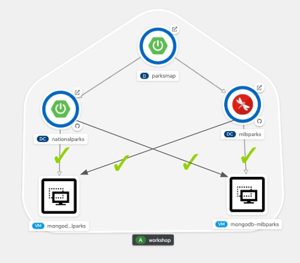
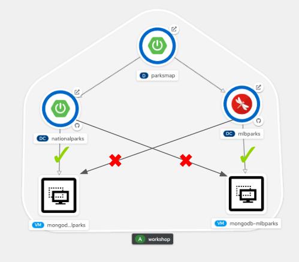

# Background: About network policy

Network policies allow you to configure isolation policies for individual pods. Network policies do not require administrative privileges, giving developers more control over the applications in their projects. 

You can use network policies to create logical zones in the SDN that map to your organization network zones. The benefit of this approach is that the location of running pods becomes irrelevant because network policies allow you to segregate traffic regardless of where it originates. 

By default, all Pods in a project are accessible from other Pods and network endpoints. To isolate one or more Pods in a project, you can create NetworkPolicy objects in that project to indicate the allowed incoming connections. Project administrators can create and delete NetworkPolicy objects within their own project.

If a Pod is matched by selectors in one or more NetworkPolicy objects, then the Pod will accept only connections that are allowed by at least one of those NetworkPolicy objects. A Pod that is not selected by any NetworkPolicy objects is fully accessible.

The following example NetworkPolicy objects demonstrate supporting different scenarios:
- Deny all traffic:

To make a project deny by default, add a NetworkPolicy object that matches all pods but accepts no traffic:
~~~yml
kind: NetworkPolicy
apiVersion: networking.k8s.io/v1
metadata:
  name: deny-by-default
spec:
  podSelector: {}
  ingress: []
~~~
- Only allow HTTP and HTTPS traffic based on pod labels:

To enable only HTTP and HTTPS access to the pods with a specific label (role=frontend in following example), add a NetworkPolicy object similar to the following:
~~~yml
kind: NetworkPolicy
apiVersion: networking.k8s.io/v1
metadata:
  name: allow-http-and-https
spec:
  podSelector:
    matchLabels:
      role: frontend
  ingress:
  - ports:
    - protocol: TCP
      port: 80
    - protocol: TCP
      port: 443
~~~

# Exercise: Configuring network policy with OpenShift SDN 

By default, all Pods in a project are accessible from other Pods and network endpoints.<br>
In this exercise, we'll **restrict access between pods and VMs** as seen from image below:<br>
 


Let's verify that nationalparks could access mongodb-mlbparks and mlbparks could access to mongodb-nationalparks.

1. Click [Workloads -> Pods](https://console-openshift-console.%cluster_subdomain%/k8s/ns/parksmap-demo/pods) from the side menu.

2. Click **nationalparks** pod.

3. Click the **Terminal** tab.

4. Run following commands and verify both mongodb services are accessible.
  

```copy
curl mongodb-mlbparks:27017
```

You should see similar output below: 
~~~bash
It looks like you are trying to access MongoDB over HTTP on the native driver port.
~~~

Now for mongodb-nationalparks

```copy
curl mongodb-nationalparks:27017
```
You should see similar output below: 

~~~bash
It looks like you are trying to access MongoDB over HTTP on the native driver port.
~~~

5. Repeat above steps for **mlbparks** pod.

```copy
curl mongodb-mlbparks:27017
```

You should see similar output below: 
~~~bash
It looks like you are trying to access MongoDB over HTTP on the native driver port.
~~~

Now for mongodb-nationalparks

```copy
curl mongodb-nationalparks:27017
```
You should see similar output below: 

~~~bash
It looks like you are trying to access MongoDB over HTTP on the native driver port.
~~~

Now, let's apply following network policy to restrict access to **mongodb-mlbparks** from **nationalparks**.

1. Click [Networking -> NetworkPolicies](https://console-openshift-console.%cluster_subdomain%/k8s/ns/parksmap-demo/networkpolicies) from the side menu.

2. Click **CreateNetworkPolicy**  pod.

3. Click **Edit YAML**.

4. Paste the following policy and click **Create**.
~~~yaml
apiVersion: networking.k8s.io/v1
kind: NetworkPolicy
metadata:
  name: mlbparks-policy
  namespace: %parksmap-project-namespace%
spec:
  podSelector:
    matchLabels:
      kubevirt.io/domain: mongodb-mlbparks
  ingress:
  - from:
    - namespaceSelector:
        matchLabels:
          kubernetes.io/metadata.name: %parksmap-project-namespace%
      podSelector:
        matchLabels:
          component: mlbparks
    ports:
    - protocol: TCP
      port: 27017
~~~

Then apply following network policy to restrict access to **mongodb-nationalparks** from **mlbparks**.

1. Click [Networking -> NetworkPolicies](https://console-openshift-console.%cluster_subdomain%/k8s/ns/parksmap-demo/networkpolicies) from the side menu.

2. Click **CreateNetworkPolicy**  pod.

3. Click **Edit YAML**.

4. Paste the following policy and click **Create**.

~~~yml
apiVersion: networking.k8s.io/v1
kind: NetworkPolicy
metadata:
  name: nationalparks-policy
  namespace: %parksmap-project-namespace%
spec:
  podSelector:
    matchLabels:
      kubevirt.io/domain: mongodb-nationalparks
  ingress:
  - from:
    - namespaceSelector:
        matchLabels:
          kubernetes.io/metadata.name: %parksmap-project-namespace%
      podSelector:
        matchLabels:
          component: nationalparks
    ports:
    - protocol: TCP
      port: 27017
~~~
Finally, Let's verify that nationalparks could access only mongodb-nationalparks and mlbparks could access to mongodb-mlbparks.

1. Click [Workloads -> Pods](https://console-openshift-console.%cluster_subdomain%/k8s/ns/parksmap-demo/pods) from the side menu.

2. Click **nationalparks** pod.

3. Click the **Terminal** tab.

4. Run following commands and verify both mongodb services are accessible.


```copy
curl mongodb-mlbparks:27017
```

You should see similar output below: 
~~~bash
It looks like you are trying to access MongoDB over HTTP on the native driver port.
~~~

Now for mongodb-nationalparks

```copy
curl mongodb-nationalparks:27017
```
You should see similar output below: 

~~~bash
It looks like you are trying to access MongoDB over HTTP on the native driver port.
~~~

5. Repeat above steps for **mlbparks** pod.


```copy
curl mongodb-mlbparks:27017
```

You should see similar output below: 
~~~bash
curl: (7) Failed connect to mongodb-nationalparks:27017; Connection timed out
~~~

Now for mongodb-nationalparks

```copy
curl mongodb-nationalparks:27017
```
You should see similar output below: 

~~~bash
curl: (7) Failed connect to mongodb-nationalparks:27017; Connection timed out
~~~
