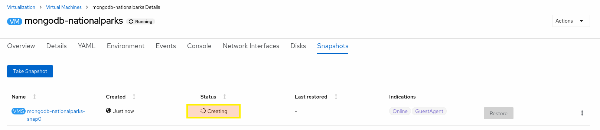

# Background: Virtual Machine snapshots

A snapshot represents the state and data of a virtual machine (VM) at a specific point in time. You can use a snapshot to restore an existing VM to a previous state (represented by the snapshot) for backup and disaster recovery or to rapidly roll back to a previous development version.

You can create and delete virtual machine (VM) snapshots for VMs, whether the VMs are powered off (**offline**) or on (**online**).

When taking a snapshot of a running VM, the controller checks that the **QEMU guest agent** is installed and running. If so, it freezes the VM file system before taking the snapshot, and thaws the file system after the snapshot is taken.

The snapshot stores a copy of each Container Storage Interface (CSI) volume attached to the VM and a copy of the VM specification and metadata. Snapshots cannot be changed after creation.

With the VM snapshots feature, cluster administrators and application developers can:
- Create a new snapshot
- List all snapshots attached to a specific VM
- Restore a VM from a snapshot
- Delete an existing VM snapshot

OpenShift Virtualization supports VM snapshots on the following:
- Red Hat OpenShift Container Storage
- Any other storage provider with the Container Storage Interface (CSI) driver that supports the Kubernetes Volume Snapshot API

# Exercise: Installing QEMU guest agent

To create snapshots of an online (Running state) VM with the highest integrity, install the QEMU guest agent.

The QEMU guest agent takes a consistent snapshot by attempting to quiesce the VM’s file system as much as possible, depending on the system workload. This ensures that in-flight I/O is written to the disk before the snapshot is taken. If the guest agent is not present, quiescing is not possible and a best-effort snapshot is taken. The conditions under which the snapshot was taken are reflected in the snapshot indications that are displayed in the web console or CLI.

> **NOTE**: The qemu-guest-agent is widely available and available by default in Red Hat virtual machines. It might be already installed and enabled on the virtual machine used in this lab module.

1. Navigate to the OpenShift Web UI so we can access the console of the `mongodb-nationalparks` virtual machine. You'll need to select "**Workloads**" --> "**Virtualization**" --> "**Virtual Machines**" --> "**mongodb-nationalparks**" --> "**Console**". You'll be able to login with "**centos/redhat**", noting that you may have to click on the console window for it to capture your input. 

> **TIP**: You might find `Serial Console` option is more responsive.

> **NOTE**: If you don't see an VMs make sure to change to the Default project via the drop down at the top of the console.

2. Once you're in the virtual machine Install the QEMU guest agent on the virtual machine
~~~bash
sudo yum install -y qemu-guest-agent
~~~

3. Ensure the service is persistent and start it
~~~bash
sudo systemctl enable --now qemu-guest-agent
~~~

# Exercise: Creating a virtual machine snapshot in the web console

Virtual machine (VM) snapshots can be created either by using the web console or in the CLI. In this exercise, let's create a snapshot of our mongodb database vm by using the web console.
<table>
  <tr>
    <td>

1. Click **Workloads** → **Virtualization** from the side menu.
   
2. Click the **Virtual Machines** tab.
   
3. Select `mongodb-nationalparks` virtual machine to open its **Overview** screen.

4. Click the **Snapshots** tab and then click **Take Snapshot**.

5. Fill in the **Snapshot Name** and optional **Description** fields.

6. Because the VM has a cloud-init disk that cannot be included in the snapshot, select the **I am aware of this warning and wish to proceed** checkbox.

7. Click **Save**.
   </td>
  </tr>
 </table>

Once you click Save to create snapshot, the vm controller checks that the QEMU guest agent is installed and running. If so, it freezes the VM file system before taking the snapshot, and initiates snapshot creation on actual storage system for each Container Storage Interface (CSI) volume attached to the VM, a copy of the VM specification and metadata is also created.

   

It should take just a little seconds to actually create the snapshot and make it Ready to use. Once the snapshot becomes **Ready** then it can be used to restore the virtual machine to that specific point in time then the snapshot is taken.

# Exercise: Destroy database

After taking an online snapshot of the database vm, let's destroy the database by forcefully deleting everything under it's data path.

1. Navigate to the OpenShift Web UI so we can access the console of the `mongodb-nationalparks` virtual machine. You'll need to select "**Workloads**" --> "**Virtualization**" --> "**Virtual Machines**" --> "**mongodb-nationalparks**" --> "**Console**". You'll be able to login with "**centos/redhat**", noting that you may have to click on the console window for it to capture your input.

2. Once you're in the virtual machine, delete everything under it's data path.
~~~bash
sudo systemctl stop mongod
~~~
~~~bash
sudo rm -rf /var/lib/mongo/*
~~~
~~~bash
sudo systemctl start mongod
~~~

Now you can check by refreshing `ParksMap` web page (Map Visualizer on OpenShift 4), it should **fail** to load national parks locations from the backend service and no longer display them on the map.

# Exercise: Restoring a virtual machine from a snapshot in the web console

In this exercise, let's restore our mongodb database vm by using the web console to the snapshot created in the previous exercise.
You can only restore to a powered off (offline) VM so we will first power off the virtual machine in this exercise.

1. Click **Workloads** → **Virtualization** from the side menu.

2. Click the **Virtual Machines** tab.

3. Select `mongodb-nationalparks` virtual machine to open its **Overview** screen.

4. If the virtual machine is running, click **Actions** → **Stop Virtual Machine** to power it down.

5. Click the **Snapshots** tab. The page displays a list of snapshots associated with the virtual machine.

6. Choose one of the following methods to restore a VM snapshot:

   - For the snapshot that you want to use as the source to restore the VM, click **Restore**.
   - Select a snapshot to open the **Snapshot Details** screen and click **Actions** → **Restore Virtual Machine Snapshot**.

7. In the confirmation pop-up window, click **Restore** to restore the VM to its previous configuration represented by the snapshot.

 

Once you click Restore to restore vm from the snapshot, it initiates snapshot restoration on actual storage system for each Container Storage Interface (CSI) volume attached to the VM and included in the snaphot, VM specification and metadata is also restored.  
It should take just a little seconds to actually restore the snapshot and make the VM ready to be powered on again.

 

After the snapshot was restored successfully and it's status become **Ready**, then you can click **Actions** → **Start Virtual Machine** to power it on.
Once the VM is powered on and boots successfully, you can refresh `ParksMap` web page (Map Visualizer on OpenShift 4). It should successfully load national parks locations from the backend service and start displaying them on the map again.

# Background: Virtual machine snapshot controller and custom resource definitions (CRDs)

The VM snapshot feature introduces three new API objects defined as CRDs for managing snapshots:

- `VirtualMachineSnapshot`: Represents a user request to create a snapshot. It contains information about the current state of the VM.

- `VirtualMachineSnapshotContent`: Represents a provisioned resource on the cluster (a snapshot). It is created by the VM snapshot controller and contains references to all resources required to restore the VM.

- `VirtualMachineRestore`: Represents a user request to restore a VM from a snapshot.

The VM snapshot controller binds a `VirtualMachineSnapshotContent` object with the `VirtualMachineSnapshot` object for which it was created, with a one-to-one mapping.

# Exercise: Creating an virtual machine snapshot in the CLI

In previous exercises in this module, we created and restored vm snapshot in the OpenShift web console. However, It's also possible to do same operations in the CLI using the CRDs above. Using CLI and Yaml/Json definitions of `VirtualMachineSnapshot` and `VirtualMachineRestore` objects to create and restore snapshot respectively, allows automating all snapshot releated operations.

In this exercise, let's create another snapshot of our mongodb database vm, this time by using the cli.

1. List the existing snapshots in the project.
~~~bash
oc get vmsnapshots
~~~
~~~bash
NAME                          SOURCEKIND       SOURCENAME              PHASE       READYTOUSE   CREATIONTIME   ERROR
mongodb-nationalparks-snap0   VirtualMachine   mongodb-nationalparks   Succeeded   true         1h            
~~~

2. Create the `VirtualMachineSnapshot` resource. The snapshot controller creates a `VirtualMachineSnapshotContent` object, binds it to the `VirtualMachineSnapshot` and updates the **status** and **readyToUse** fields of the VirtualMachineSnapshot object. The name of the new vm snapshot will be `mongodb-nationalparks-snap1` in this example.
~~~bash
$ cat << EOF | oc apply -f -
apiVersion: snapshot.kubevirt.io/v1alpha1
kind: VirtualMachineSnapshot
metadata:
  name: mongodb-nationalparks-snap1 
spec:
  source:
    apiGroup: kubevirt.io
    kind: VirtualMachine
    name: mongodb-nationalparks 
EOF
~~~
~~~bash
virtualmachinesnapshot.snapshot.kubevirt.io/mongodb-nationalparks-snap1 created
~~~

3. **Optional**: As in the previous exercise, the snapshot creation will take a little seconds in the background, and you can use the wait command and monitor the status of the snapshot.
~~~bash
oc wait vmsnapshot mongodb-nationalparks-snap1 --for condition=Ready
~~~

4. List the existing snapshots in the project again to verify that the new vm snapshot is created successfully.
~~~bash
oc get vmsnapshots
~~~
~~~bash
NAME                          SOURCEKIND       SOURCENAME              PHASE       READYTOUSE   CREATIONTIME   ERROR
mongodb-nationalparks-snap0   VirtualMachine   mongodb-nationalparks   Succeeded   true         1h            
mongodb-nationalparks-snap1   VirtualMachine   mongodb-nationalparks   Succeeded   true         9s             
~~~

5. You can also verify that the `VirtualMachineSnapshot` object is created and bound with `VirtualMachineSnapshotContent` by describing it. The `readyToUse` flag must be set to `true`.
~~~bash
oc describe vmsnapshot mongodb-nationalparks-snap1
~~~

~~~bash
Name:         mongodb-nationalparks-snap1
Namespace:    backup-test
Labels:       <none>
Annotations:  <none>
API Version:  snapshot.kubevirt.io/v1alpha1
Kind:         VirtualMachineSnapshot
Metadata:
  Creation Timestamp:  2021-11-25T12:24:20Z
  Finalizers:
    snapshot.kubevirt.io/vmsnapshot-protection
  Generation:  5
  Resource Version:  980266652
  UID:               7a46dfc9-9904-42e9-a0a3-c02ef43d0f2b
Spec:
  Source:
    API Group:  kubevirt.io
    Kind:       VirtualMachine
    Name:       mongodb-nationalparks
Status:
  Conditions:
    Last Probe Time:       <nil>
    Last Transition Time:  2021-11-25T12:24:33Z
    Reason:                Operation complete
    Status:                False
    Type:                  Progressing
    Last Probe Time:       <nil>
    Last Transition Time:  2021-11-25T12:24:33Z
    Reason:                Operation complete
    Status:                True
    Type:                  Ready
  Creation Time:           2021-11-25T12:24:33Z
  Indications:
    Online
    GuestAgent
  Phase:                                  Succeeded
  Ready To Use:                           true
  Source UID:                             64e2d56b-828c-42d2-849f-2ee5d8156226
  Virtual Machine Snapshot Content Name:  vmsnapshot-content-7a46dfc9-9904-42e9-a0a3-c02ef43d0f2b
Events:
  Type    Reason                                         Age    From                 Message
  ----    ------                                         ----   ----                 -------
  Normal  SuccessfulVirtualMachineSnapshotContentCreate  5m45s  snapshot-controller  Successfully created VirtualMachineSnapshotContent vmsnapshot-content-7a46dfc9-9904-42e9-a0a3-c02ef43d0f2b
~~~

6. `VirtualMachineSnapshotContent` objects represent a provisioned resource on the cluster, a vm snapshot in our case. It is created by the VM snapshot controller and contains references to all resources required to restore the VM. The underlying kubernetes StorageClass, PersistentVolume, VolumeSnapshot objects used and created for each attached disk and VM's metadata information is stored in the `VirtualMachineSnapshotContent` object. So it contains all the information needed to restore the VM to that specific point in time that snapshot is taken.
You can see these details by describing the VirtualMachineSnapshotContent bound to our vm snapshot.
~~~bash
oc describe vmsnapshotcontent vmsnapshot-content-7a46dfc9-9904-42e9-a0a3-c02ef43d0f2b
~~~

# Exercise: Delete the VM's boot disk

To see how to restore the VM in the CLI, let's delete the VM's boot disk completely this time after powering of the VM.

1. Click **Workloads** → **Virtualization** from the side menu.

2. Click the **Virtual Machines** tab.

3. Select `mongodb-nationalparks` virtual machine to open its **Overview** screen.

4. If the virtual machine is running, click **Actions** → **Stop Virtual Machine** to power it down.

5. Click the **Disks** tab. The page displays a list of disks attached to the virtual machine.

6. Select the **disk** named `mongodb-nationalparks` which is the boot disk of our database VM, and click the Options menu  and select **Delete**.

7. In the confirmation pop-up window, select the **Delete DataVolume and PVC** checkbox click **Detach** to delete the disk completely.

 

Now you can check by refreshing `ParksMap` web page (Map Visualizer on OpenShift 4), it should **fail** to load national parks locations from the backend service and no longer display them on the map.

# Exercise: Delete the VM's boot disk

In this exercise, let's restore our mongodb database vm by using the CLI to the snapshot created in the previous exercise.
You can only restore to a powered off (offline) VM so we will first power off the virtual machine in this exercise.

1. List the existing vmrestore objects in the project. There should be already a vmrestore object in the project because we initiated one in the previous exercise using the web console.
~~~bash
oc get vmrestores
~~~
~~~bash
NAME                                         TARGETKIND       TARGETNAME              COMPLETE   RESTORETIME   ERROR
mongodb-nationalparks-snap0-restore-pb4mbl   VirtualMachine   mongodb-nationalparks   true       1h           
~~~

2. Create a `VirtualMachineRestore` object that specifies the name of the VM we want to restore and the name of the snapshot to be used as the source. The name of the vm and it's snapshot will be `mongodb-nationalparks` and `mongodb-nationalparks-snap1` in this example respectively. Right after creating the `VirtualMachineRestore` object, the snapshot controller updates the status fields of the VirtualMachineRestore object and replaces the existing VM configuration with the snapshot content.
~~~bash
$ cat << EOF | oc apply -f -
apiVersion: snapshot.kubevirt.io/v1alpha1
kind: VirtualMachineRestore
metadata:
  name: mongodb-nationalparks-vmrestore1
spec:
  target:
    apiGroup: kubevirt.io
    kind: VirtualMachine
    name: mongodb-nationalparks
  virtualMachineSnapshotName: mongodb-nationalparks-snap1
EOF
~~~
~~~bash
virtualmachinerestore.snapshot.kubevirt.io/mongodb-nationalparks-vmrestore1 created
~~~

3. **Optional**: As in the previous exercise, the vm restoration will take a little seconds in the background. You can use the wait command and monitor the status of the snapshot.
~~~bash
oc wait vmrestore mongodb-nationalparks-vmrestore1 --for condition=Ready
~~~

4. List the existing vm restore objects in the project again to verify that the new vm restore is created successfully. If the vm restored successfully then the `complete` flag must be set to `true`. 
~~~bash
oc get vmrestores
~~~
~~~bash
NAME                                         TARGETKIND       TARGETNAME              COMPLETE   RESTORETIME   ERROR
mongodb-nationalparks-snap0-restore-pb4mbl   VirtualMachine   mongodb-nationalparks   true       1h           
mongodb-nationalparks-vmrestore1             VirtualMachine   mongodb-nationalparks   true       1m         
~~~

5. You can also describe the `VirtualMachineRestore` object to see additional details such as operation start/end times, disks restored, etc. The `Complete` flag must be set to `true`.
~~~bash
oc describe vmsnapshot mongodb-nationalparks-snap1
~~~

After the snapshot was restored successfully and it's `complete` flag is set to `true`, then you can click **Actions** → **Start Virtual Machine** to power the VM on.
Once the VM is powered on and boots successfully, you can refresh `ParksMap` web page (Map Visualizer on OpenShift 4). It should successfully load national parks locations from the backend service and start displaying them on the map again.

That's it for taking vm snapshots and performing restores - we've created snapshots of our mongodb database vm using both OpenShift web console and CLI, and restored it after deleting data files and underlying vm disk.
=======