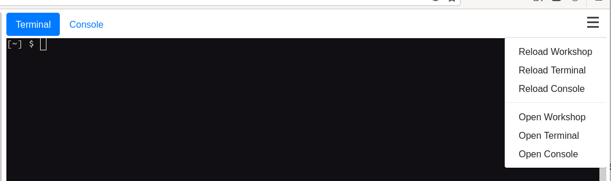

Now that we've got OpenShift Virtualization deployed, let's take a look at storage. First, switch back to the "**Terminal**" view in your lab environment. What you'll find is that OpenShift Data Foundation (ODF, although formerly known as OpenShift Container Storage/OCS) has been deployed for you:

~~~bash
$ oc get sc
NAME                                    PROVISIONER                             RECLAIMPOLICY   VOLUMEBINDINGMODE      ALLOWVOLUMEEXPANSION   AGE
localblock                              kubernetes.io/no-provisioner            Delete          WaitForFirstConsumer   false                  6h49m
ocs-storagecluster-ceph-rbd (default)   openshift-storage.rbd.csi.ceph.com      Delete          Immediate              true                   6h48m
ocs-storagecluster-ceph-rgw             openshift-storage.ceph.rook.io/bucket   Delete          Immediate              false                  6h48m
ocs-storagecluster-cephfs               openshift-storage.cephfs.csi.ceph.com   Delete          Immediate              true                   6h48m
openshift-storage.noobaa.io             openshift-storage.noobaa.io/obc         Delete          Immediate              false                  6h44m

$ oc get csv -n openshift-storage
NAME                  DISPLAY                       VERSION   REPLACES              PHASE
ocs-operator.v4.8.4   OpenShift Container Storage   4.8.4     ocs-operator.v4.8.3   Succeeded
~~~

We're going to setup two different types of storage in this section, firstly OCS/ODF based shared storage, and also `hostpath` storage which uses the hypervisor's local disks, somewhat akin to ephemeral storage provided by OpenStack.

First, make sure you're in the default project:

~~~bash
$ oc project default
Now using project "default" on server "https://172.30.0.1:443".
~~~

>**NOTE**: If you don't use the default project for the next few lab steps, it's likely that you'll run into some errors - some resources are scoped, i.e. aligned to a namespace, and others are not. Ensuring you're in the default namespace now will ensure that all of the coming lab steps should flow together.

Now let's create a new OCS-based Peristent Volume Claim (PVC). For this volume claim we will use a special annotation `cdi.kubevirt.io/storage.import.endpoint` which utilises the Kubernetes Containerized Data Importer (CDI). 

> **NOTE**: CDI is a utility to import, upload, and clone virtual machine images for OpenShift virtualisation. The CDI controller watches for this annotation on the PVC and if found it starts a process to import, upload, or clone. When the annotation is detected the `CDI` controller starts a pod which imports the image from that URL. Cloning and uploading follow a similar process. Read more about the Containerised Data Importer [here](https://github.com/kubevirt/containerized-data-importer).

Basically we are asking OpenShift to create this PVC and use the image in the endpoint to fill it. In this case we use `"http://192.168.123.100:81/rhel8-kvm.img"` in the annotation to ensure that upon instantiation of the PV it is populated with the contents of our specific RHEL8 KVM image. In addition to triggering the CDI utility we also specify the storage class that OCS/ODF uses (`ocs-storagecluster-ceph-rbd`) which will dynamically create the PV in the backend Ceph storage platform. Finally note the `requests` section - we are asking for a 40gb volume size.

OK, let's create the PVC with all this included!

~~~bash
$ cat << EOF | oc apply -f -
apiVersion: v1
kind: PersistentVolumeClaim
metadata:
  name: "rhel8-ocs"
  labels:
    app: containerized-data-importer
  annotations:
    cdi.kubevirt.io/storage.import.endpoint: "http://192.168.123.100:81/rhel8-kvm.img"
spec:
  volumeMode: Block
  storageClassName: ocs-storagecluster-ceph-rbd
  accessModes:
  - ReadWriteMany
  resources:
    requests:
      storage: 40Gi
EOF

persistentvolumeclaim/rhel8-ocs created
~~~

Once created, CDI triggers the importer pod automatically to take care of the conversion for you:

~~~bash
$ oc get pods
NAME                   READY   STATUS              RESTARTS   AGE
importer-rhel8-ocs     0/1     ContainerCreating   0          1s
~~~

Watch the logs and you can see the process, it may initially give an error about the pod waiting to start, you can retry after a few seconds:

~~~bash
$ oc logs importer-rhel8-ocs -f
I1103 17:33:42.409423       1 importer.go:52] Starting importer
I1103 17:33:42.442150       1 importer.go:135] begin import process
I1103 17:33:42.447139       1 data-processor.go:329] Calculating available size
I1103 17:33:42.448349       1 data-processor.go:337] Checking out block volume size.
I1103 17:33:42.448380       1 data-processor.go:349] Request image size not empty.
I1103 17:33:42.448395       1 data-processor.go:354] Target size 40Gi.
I1103 17:33:42.448977       1 nbdkit.go:269] Waiting for nbdkit PID.
I1103 17:33:42.949247       1 nbdkit.go:290] nbdkit ready.
I1103 17:33:42.949288       1 data-processor.go:232] New phase: Convert
I1103 17:33:42.949328       1 data-processor.go:238] Validating image
I1103 17:33:42.969690       1 qemu.go:250] 0.00
I1103 17:33:47.145392       1 qemu.go:250] 1.02
I1103 17:33:53.728302       1 qemu.go:250] 2.03
I1103 17:33:55.924329       1 qemu.go:250] 3.05
I1103 17:33:58.014054       1 qemu.go:250] 4.06
(...)
I0317 11:46:56.253155       1 prometheus.go:69] 98.24
I0317 11:46:57.253350       1 prometheus.go:69] 100.00
I0317 11:47:00.195494       1 data-processor.go:205] New phase: Resize
I0317 11:47:00.524989       1 data-processor.go:268] Expanding image size to: 40Gi
I0317 11:47:00.878420       1 data-processor.go:205] New phase: Complete
~~~

If you're quick, you can Ctrl-C this watch (don't worry, it won't kill the import, you're just watching its logs), and view the structure of the importer pod to get some of the configuration it's using:

~~~bash
$ oc describe pod $(oc get pods | awk '/importer/ {print $1;}')
Name:         importer-rhel8-ocs
Namespace:    default
Priority:     0
Node:         ocp4-worker1.aio.example.com/192.168.123.104
Start Time:   Wed, 03 Nov 2021 17:32:59 +0000
Labels:       app=containerized-data-importer
              app.kubernetes.io/component=storage
              app.kubernetes.io/managed-by=cdi-controller
              app.kubernetes.io/part-of=hyperconverged-cluster
              app.kubernetes.io/version=v4.9.0
              cdi.kubevirt.io=importer
(...)
    Environment:
      IMPORTER_SOURCE:               http
      IMPORTER_ENDPOINT:             http://192.168.123.100:81/rhel8-kvm.img
      IMPORTER_CONTENTTYPE:          kubevirt
      IMPORTER_IMAGE_SIZE:           40Gi
      OWNER_UID:                     11b007c9-293f-46a6-b1e2-e3a59b66ec4b
      FILESYSTEM_OVERHEAD:           0
      INSECURE_TLS:                  false
(...)
    Mounts:
      /var/run/secrets/kubernetes.io/serviceaccount from kube-api-access-q6d4s (ro)
    Devices:
      /dev/cdi-block-volume from cdi-data-vol
(...)
Volumes:
  cdi-data-vol:
    Type:       PersistentVolumeClaim (a reference to a PersistentVolumeClaim in the same namespace)
    ClaimName:  rhel8-ocs
    ReadOnly:   false
(...)
~~~

Here we can see the importer settings we requested through our claims, such as `IMPORTER_SOURCE`, `IMPORTER_ENDPOINT`, and `IMPORTER_IMAGE_SIZE`. Once this process has completed you'll notice that your PVC is ready to use:

~~~bash
$ oc get pvc
NAME        STATUS   VOLUME                                     CAPACITY   ACCESS MODES   STORAGECLASS                  AGE
rhel8-ocs   Bound    pvc-1a4ea2c5-937c-486d-932c-b2b7d161ec0e   40Gi       RWX            ocs-storagecluster-ceph-rbd   50s
~~~

This same configuration should be reflected when asking OpenShift for a list of *all* persistent volumes (`PV`), noting that there will be some additional PV's that are used with OpenShift Data Foundation as well as the image registry:

~~~bash
$ oc get pv
NAME                                       CAPACITY   ACCESS MODES   RECLAIM POLICY   STATUS   CLAIM                                           STORAGECLASS                  REASON   AGE
local-pv-6751e4c7                          100Gi      RWO            Delete           Bound    openshift-storage/ocs-deviceset-0-data-1g87z7   localblock                             52m
local-pv-759d6092                          100Gi      RWO            Delete           Bound    openshift-storage/ocs-deviceset-1-data-1kks6c   localblock                             52m
local-pv-911d74ba                          100Gi      RWO            Delete           Bound    openshift-storage/ocs-deviceset-1-data-0f9khs   localblock                             52m
local-pv-9d4e1eb0                          100Gi      RWO            Delete           Bound    openshift-storage/ocs-deviceset-2-data-0hvt5v   localblock                             52m
local-pv-be875671                          100Gi      RWO            Delete           Bound    openshift-storage/ocs-deviceset-0-data-0vlwls   localblock                             52m
local-pv-e2c7f8a9                          100Gi      RWO            Delete           Bound    openshift-storage/ocs-deviceset-2-data-17kkwt   localblock                             52m
pvc-1a4ea2c5-937c-486d-932c-b2b7d161ec0e   40Gi       RWX            Delete           Bound    default/rhel8-ocs                               ocs-storagecluster-ceph-rbd            77s
pvc-ee63c434-9d72-4bc4-b224-a7d5ae7aa9b9   100Gi      RWX            Delete           Bound    openshift-image-registry/ocs-imgreg             ocs-storagecluster-cephfs              45m
pvc-f8f83266-dfb2-463b-8707-d4514566eb67   50Gi       RWO            Delete           Bound    openshift-storage/db-noobaa-db-pg-0             ocs-storagecluster-ceph-rbd            46m
~~~

If we want to take a look into the image itself on the Ceph-backed storage system we can certainly match the PVC to the underlying RBD image. First describe the persistent volume to get the UUID of the image name, matching the ID of your PV, which will be different from the example below:

~~~bash
$ oc describe pv/pvc-11b007c9-293f-46a6-b1e2-e3a59b66ec4b | grep imageName
      imageName=csi-vol-70d062c5-408f-11ec-a2b0-0a580a830025
~~~

Now we can have a look at the image on the OpenShift cluster itself, first by attaching to our Ceph tools pod, and then asking for details about the image in question, noting the additionally specified pool name "*ocs-storagecluster-cephblockpool*" as this is a "block" type of PV:

~~~bash
$ oc exec -it -n openshift-storage \
    $(oc get pods -n openshift-storage | awk '/tools/ {print $1;}') bash
(...)

bash-4.4$ rbd info csi-vol-70d062c5-408f-11ec-a2b0-0a580a830025 \
          --pool=ocs-storagecluster-cephblockpool

rbd image 'csi-vol-70d062c5-408f-11ec-a2b0-0a580a830025':
	size 40 GiB in 10240 objects
	order 22 (4 MiB objects)
	snapshot_count: 0
	id: 115b595bde9a
	block_name_prefix: rbd_data.115b595bde9a
	format: 2
	features: layering
	op_features: 
	flags: 
	create_timestamp: Mon Nov  8 12:28:56 2021
	access_timestamp: Mon Nov  8 12:28:56 2021
	modify_timestamp: Mon Nov  8 12:28:56 2021

bash-4.4$ rbd disk-usage csi-vol-70d062c5-408f-11ec-a2b0-0a580a830025 \
          --pool=ocs-storagecluster-cephblockpool

NAME                                         PROVISIONED USED
csi-vol-70d062c5-408f-11ec-a2b0-0a580a830025      40 GiB 8.7 GiB

bash-4.4$ exit
exit
~~~

You'll see that this image matches the correct size, corresponds to the PV that we requested be created for us, and has consumed approximately ~9GB of the disk, as we've cloned a copy of CentOS8 into our persistent volume via the data importer tool. We'll use this persistent volume to spawn a virtual machine in a later step.

## Hostpath Storage

Now let's create a second storage type based on `hostpath` storage, which utilises the disk on the hypervisors (workers) to provide storage space for us, useful when you want to leverage fast storage locally and don't need to rely on shared storage - the data here is essentially ephemeral and limits certain functionality such as live migration. As we're not using a pre-configured shared storage pool for this we need to ask OpenShift's `MachineConfigOperator` to do some work for us directly on our worker nodes.

Run the following in the terminal window - it will generate a new `MachineConfig` that the cluster will enact, recognising that we only match on the worker nodes (`machineconfiguration.openshift.io/role: worker`):

~~~bash
$ cat << EOF | oc apply -f -
apiVersion: machineconfiguration.openshift.io/v1
kind: MachineConfig
metadata:
  name: 50-set-selinux-for-hostpath-provisioner-worker
  labels:
    machineconfiguration.openshift.io/role: worker
spec:
  config:
    ignition:
      version: 2.2.0
    systemd:
      units:
        - contents: |
            [Unit]
            Description=Set SELinux chcon for hostpath provisioner
            Before=kubelet.service

            [Service]
            Type=oneshot
            RemainAfterExit=yes
            ExecStartPre=-mkdir -p /var/hpvolumes
            ExecStart=/usr/bin/chcon -Rt container_file_t /var/hpvolumes

            [Install]
            WantedBy=multi-user.target
          enabled: true
          name: hostpath-provisioner.service
EOF

machineconfig.machineconfiguration.openshift.io/50-set-selinux-for-hostpath-provisioner-worker created
~~~

This deploys a new `systemd` unit file on the worker nodes to create a new directory at `/var/hpvolumes` and relabels it with the correct SELinux contexts at boot-time, ensuring that OpenShift can leverage that directory for local storage. We do this via a `MachineConfig` as the CoreOS machine is immutable. You should first start to witness OpenShift starting to drain the worker nodes and disable scheduling on them so the nodes can be rebooted safely, although it's likely that if you're not quick enough to issue this command you may temporarily lose access to your cluster:

~~~bash
$ oc get mcp
NAME     CONFIG                                             UPDATED   UPDATING   DEGRADED   MACHINECOUNT   READYMACHINECOUNT   UPDATEDMACHINECOUNT   DEGRADEDMACHINECOUNT   AGE
master   rendered-master-9d055df78d00fda1c014f7247c4270b2   True      False      False      3              3                   3                     0                      95m
worker   rendered-worker-08d4857819910827ea841dcf71bc4a0a   False     True       False      3              0                   0                     0                      95m

$ oc get nodes
ocp4-master1.aio.example.com   Ready                      master   95m   v1.22.0-rc.0+a44d0f0
ocp4-master2.aio.example.com   Ready                      master   96m   v1.22.0-rc.0+a44d0f0
ocp4-master3.aio.example.com   Ready                      master   95m   v1.22.0-rc.0+a44d0f0
ocp4-worker1.aio.example.com   Ready,SchedulingDisabled   worker   76m   v1.22.0-rc.0+a44d0f0
ocp4-worker2.aio.example.com   Ready                      worker   76m   v1.22.0-rc.0+a44d0f0
ocp4-worker3.aio.example.com   Ready                      worker   76m   v1.22.0-rc.0+a44d0f0
~~~

> **NOTE**: This will take a few minutes to reflect on the cluster, and causes the worker nodes to reboot (where the routers are running). You'll witness a disruption on the lab guide functionality where you will see the consoles hang and/or display a "Closed" image. In some cases we have needed to refresh the entire browser.
>
> 

> It should automatically reconnect but if it doesn't, you can try reloading the terminal by clicking the three bars in the top right hand corner:

When you're able to issue commands again, make sure you're in the correct namespace again:

~~~bash
$ oc project default
Now using project "default" on server "https://172.30.0.1:443".
~~~

Now wait for the following command to return `True` as it indicates when the `MachineConfigPool`'s worker has been updated with the latest `MachineConfig` requested:

~~~bash
$ oc get machineconfigpool worker -o=jsonpath="{.status.conditions[?(@.type=='Updated')].status}{\"\n\"}"
True
~~~

Now we can set the HostPathProvisioner configuration itself, i.e. telling the operator what path to actually use - the systemd file we just applied merely ensures that the directory is present and has the correct SELinux labels applied to it:

~~~bash
$ cat << EOF | oc apply -f -
apiVersion: hostpathprovisioner.kubevirt.io/v1beta1
kind: HostPathProvisioner
metadata:
  name: hostpath-provisioner
spec:
  imagePullPolicy: IfNotPresent
  pathConfig:
    path: "/var/hpvolumes"
    useNamingPrefix: false
  workload:
    nodeSelector:
      kubernetes.io/os: linux
EOF

hostpathprovisioner.hostpathprovisioner.kubevirt.io/hostpath-provisioner created
~~~

When you've applied this config, an additional pod will be spawned on each of the worker nodes; this pod is responsible for managing the hostpath access on the respective host; note the shorter age (42s in the example below):

~~~bash
$ oc get pods -n openshift-cnv | grep hostpath
hostpath-provisioner-fxwnc                             1/1     Running   0               16s
hostpath-provisioner-operator-5c9cdb75d-crwv8          1/1     Running   0               14m
hostpath-provisioner-t9g4g                             1/1     Running   0               16s
hostpath-provisioner-twb46                             1/1     Running   0               16s
~~~

We're now ready to configure a new `StorageClass` for the HostPath based storage:

~~~bash
$ cat << EOF | oc apply -f -
apiVersion: storage.k8s.io/v1
kind: StorageClass
metadata:
  name: hostpath-provisioner
provisioner: kubevirt.io/hostpath-provisioner
reclaimPolicy: Delete
volumeBindingMode: WaitForFirstConsumer
EOF

storageclass.storage.k8s.io/hostpath-provisioner created
~~~

You'll note that this storage class **does** have a provisioner, and therefore like the OCS provisioner it can create persistent volumes dynamically when a claim is submitted by the user. Let's validate that by creating a new hostpath based PVC that contains the same image like before (note the `cdi.kubevirt.io/storage.import.endpoint` annotation), and checking that it creates the associated PV:

~~~bash
$ cat << EOF | oc apply -f -
apiVersion: v1
kind: PersistentVolumeClaim
metadata:
  name: "rhel8-hostpath"
  labels:
    app: containerized-data-importer
  annotations:
    cdi.kubevirt.io/storage.import.endpoint: "http://192.168.123.100:81/rhel8-kvm.img"                       
spec:
  volumeMode: Filesystem
  storageClassName: hostpath-provisioner
  accessModes:
  - ReadWriteOnce
  resources:
    requests:
      storage: 40Gi
EOF

persistentvolumeclaim/rhel8-hostpath created
~~~

Now check that it successfully binds - you should have two here, one for hostpath and the one previously created within OCS:

~~~bash
$ oc get pvc
NAME             STATUS   VOLUME                                     CAPACITY   ACCESS MODES   STORAGECLASS                  AGE
rhel8-hostpath   Bound    pvc-0f3ff50d-12b1-4ad6-8beb-be742a6e674a   79Gi       RWO            hostpath-provisioner          85s
rhel8-ocs        Bound    pvc-1a4ea2c5-937c-486d-932c-b2b7d161ec0e   40Gi       RWX            ocs-storagecluster-ceph-rbd   33m
~~~

> **NOTE**: The capacity displayed above lists the available space on the host, not the actual size of the persistent volume when being used.

As we're using the containerised data importer tool, we expect the importer image to run again:

~~~bash
$ oc get pods
NAME                      READY   STATUS    RESTARTS   AGE
importer-rhel8-hostpath   1/1     Running   0          88s
~~~

> **NOTE**: You can watch the output of this importer pod with `$ oc logs -f importer-rhel8-hostpath`.  Didn't see any pods? You likely just missed it. To be sure the PV was created continue to the next command.

Let's look more closely at our new PV (get the ID from the previous command `oc get pvc`). Describe the new hostpath PV, noting that you'll need to adapt for the `uuid` in your environment:

~~~bash
$ oc describe pv/pvc-0f3ff50d-12b1-4ad6-8beb-be742a6e674a
Name:              pvc-0f3ff50d-12b1-4ad6-8beb-be742a6e674a
Labels:            <none>
Annotations:       hostPathProvisionerIdentity: kubevirt.io/hostpath-provisioner
                   kubevirt.io/provisionOnNode: ocp4-worker2.aio.example.com
                   pv.kubernetes.io/provisioned-by: kubevirt.io/hostpath-provisioner
Finalizers:        [kubernetes.io/pv-protection]
StorageClass:      hostpath-provisioner
Status:            Bound
Claim:             default/rhel8-hostpath
Reclaim Policy:    Delete
Access Modes:      RWO
VolumeMode:        Filesystem
Capacity:          79Gi
Node Affinity:     
  Required Terms:  
    Term 0:        kubernetes.io/hostname in [ocp4-worker2.aio.example.com]
Message:           
Source:
    Type:          HostPath (bare host directory volume)
    Path:          /var/hpvolumes/pvc-0f3ff50d-12b1-4ad6-8beb-be742a6e674a
    HostPathType:  
Events:            <none>
~~~

There's a few important details here worth noting, namely the `kubevirt.io/provisionOnNode` annotation, and the path of the volume on that node. In the example above you can see that the volume was provisioned on *ocp4-worker2.aio.example.com*, the second of our three worker nodes (in your environment it may have been scheduled onto a different worker). 

Let's look more closely to verify that this truly has been created for us on the designated worker.

> **NOTE**: You may have to substitute `ocp4-worker1` with `ocp4-worker2` if your hostpath volume was scheduled to worker2. You'll need to also match the UUID to the one that was generated by your PVC. 

~~~bash
$ oc debug node/ocp4-worker2.aio.example.com
Starting pod/ocp4-worker2aioexamplecom-debug ...
To use host binaries, run `chroot /host`
Pod IP: 192.168.123.105
If you don't see a command prompt, try pressing enter.

sh4.4# chroot /host

sh4.4# ls -l /var/hpvolumes/pvc-0f3ff50d-12b1-4ad6-8beb-be742a6e674a/
total 5784756                                                                                            
-rwxr-xr-x. 1 root root 40587231232 Nov  8 08:54 disk.img

sh4.4# file /var/hpvolumes/pvc-0f3ff50d-12b1-4ad6-8beb-be742a6e674a/disk.img
/var/hpvolumes/pvc-0f3ff50d-12b1-4ad6-8beb-be742a6e674a/disk.img: DOS/MBR boot sector

sh4.4# exit
sh4.4# exit
Removing debug pod ...

$ oc whoami
system:serviceaccount:workbook:cnv
~~~

Make sure that you've executed the two `exit` commands above - we need to make sure that you're back to the right shell before continuing, and aren't still inside of the debug pod. Congratulations - we've verified that our storage is setup correctly and that we have two storage options - OpenShift Data Foundation (OCS) and HostPath storage.
