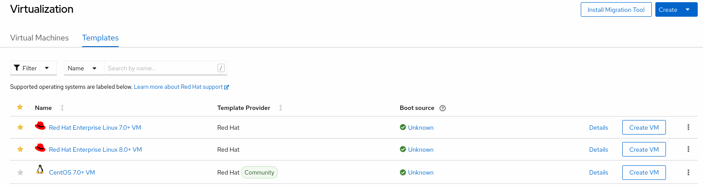
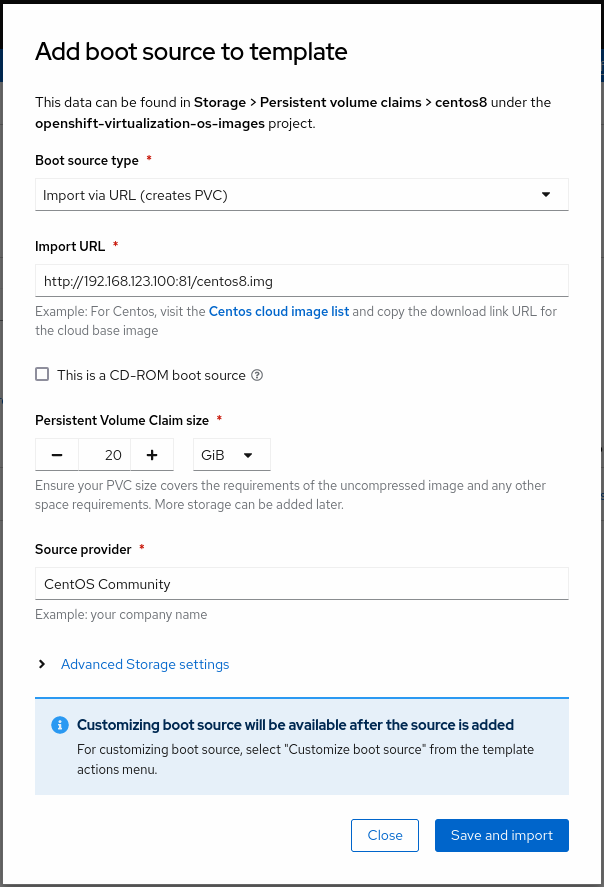
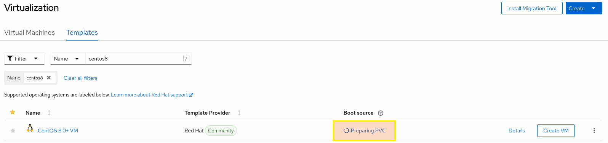
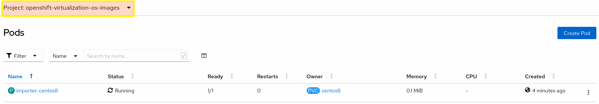
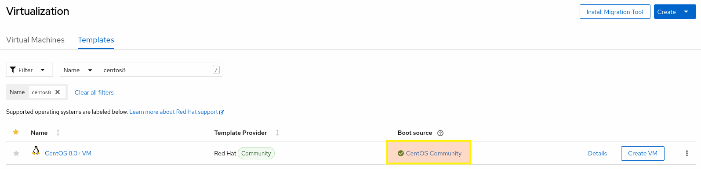

## About virtual machine templates and boot sources

Virtual machines consist of a virtual machine definition and one or more disks that are backed by data volumes. Virtual machine templates enable you to create virtual machines using predefined virtual machine specifications, so simplify the subsequent, repeated creation of similar virtual machines.

Every virtual machine template requires a **boot source**, which is a fully configured virtual machine disk image including configured drivers. Each virtual machine template contains a virtual machine definition with a pointer to the boot source. Each boot source has a predefined name and namespace. For some operating systems, a boot source is automatically provided. If it is not provided, then an administrator must prepare a custom boot source.

The namespace `openshift-virtualization-os-images` enables the feature and is installed with the OpenShift Virtualization Operator. Once the boot source feature is installed, you can create boot sources, attach them to templates, and create virtual machines from the templates.

Define a boot source by using a persistent volume claim (PVC) that is populated by uploading a local file, cloning an existing PVC, importing from a registry, or by URL. Attach a boot source to a virtual machine template by using the web console. After the boot source is attached to a virtual machine template, you create any number of fully configured ready-to-use virtual machines from the template.

Preconfigured Red Hat virtual machine templates are listed in the **Templates** tab within the [Workloads -> Virtualization](https://console-openshift-console.%cluster_subdomain%/k8s/ns/default/virtualization/templates) page. These templates are available for different versions of Red Hat Enterprise Linux, Fedora, Microsoft Windows 10, and Microsoft Windows Servers. Each Red Hat virtual machine template is preconfigured with the operating system image, default settings for the operating system, flavor (CPU and memory), and workload type (server).

</td>

The Templates tab displays four types of virtual machine templates:

- **Red Hat Supported** templates are fully supported by Red Hat.
- **User Supported** templates are Red Hat Supported templates that were cloned and created by users.
- **Red Hat Provided** templates have limited support from Red Hat.
- **User Provided** templates are Red Hat Provided templates that were cloned and created by users.

## Exercise: Importing a CentOS Stream 8 image as a boot source
There are four methods for selecting and adding a boot source in the web console:
- **Upload local file** (creates PVC)
- **Import via URL** (creates PVC)
- **Clone existing PVC** (creates PVC)
- **Import via Registry** (creates PVC)

In this exercise, we will use the **Import Via URL** method to import a CentOS Stream 8 qcow2 disk image from our internal http server.
We followed a similar procedure in the **Storage Setup** lab and used the CDI tool on the command line to upload a RHEL8 disk image into a new PVC.
This time we will upload another disk image but will use OpenShift web console instead of the CLI. In the background, a new PVC will be created and CDI will be used to import the disk image from http location into this newly created PVC. This new PVC will then be set as the boot source of the selected CentOS 8 template.
This PVC will be cloned for each new virtual machine created using this template.

<table>
  <tr>
    <td>

1. Click [Workloads -> Virtualization](https://console-openshift-console.%cluster_subdomain%/k8s/ns/parksmap-demo/virtualization) from the side menu.

2. Click the **Templates** tab.

3. Identify the `CentOS 8.0+ VM` template to configure its boot source and click **Add source**.

4. In the **Add boot source to template window**, select **Import via URL (creates PVC)** from the Boot source type list.

5. Input `http://%bastion-host%:81/rhel8-kvm.img` as the URL of the guest image into the **Import URL** field.
   
6. Set **Persistent Volume Claim size** as **20 GiB**. This will also be the size of the root disk of the VMs created by using this template.
   
7. Fill in the **Source provider** field with the name of the source disk provider. We can enter `CentOS Community` here in this exercise.
8. and click **Save and import**.

   </td>
   <td></td>
  </tr>
 </table>

Once you click **Save and import** to import disk image, a new PersistentVolumeClaim of the specified size is automatically provisioned using the selected storage class, which is ceph-rbd in this exercise.



 After creating the new PersistentVolumeClaim, a CDI (Containerized Data Importer) pod is started in the `openshift-virtualization-os-images` namespace. This CDI pod downloads the specified disk image from the Http URL and populates the newly created PersistentVolumeClaim with the contents of that disk image. You can see this CDI pod by switching into the `openshift-virtualization-os-images` project and selecting [Workloads -> Pods](https://console-openshift-console.%cluster_subdomain%/k8s/ns/openshift-virtualization-os-images/pods) from the side menu.



You can also view the import progress by listing the data volumes in the `openshift-virtualization-os-images` namespace.

```execute
oc get datavolumes -n openshift-virtualization-os-images
```

~~~bash
NAME        PHASE              PROGRESS   RESTARTS   AGE
centos7     Succeeded          100.0%                253d
centos8     ImportInProgress   2.00%                 7m28s
fedora      Succeeded          100.0%                253d
rhcos-490   Succeeded          100.0%     1          22d
rhel7       Succeeded          100.0%     1          253d
rhel8       Succeeded          100.0%                255d
win10       Succeeded          100.0%                253d
~~~

Once the import progress is reached up to 100% and succeeded, you can verify that a boot source was added to the template:

1. In the OpenShift Virtualization console, click [Workloads -> Virtualization](https://console-openshift-console.%cluster_subdomain%/k8s/ns/default/virtualization/templates) from the side menu.
   
2. You should be in the Templates tab.

3. Confirm that the tile for `CentOS 8.0+ VM` template displays a green checkmark.

You can now use this template to create CentOS 8 virtual machines.



That's it for adding boot sources to a template. We have imported a Centos 8 cloud disk image into a new PVC and attached that onto a CentOS 8 virtual machine template which we will use to create new virtual machines in the next labs.
