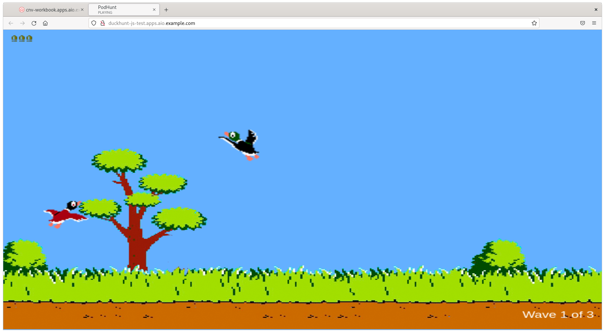

On the right hand side where the web terminal is, let's see if we can check the nodes:

~~~bash
$ oc get nodes
NAME                           STATUS   ROLES    AGE   VERSION
ocp4-master1.aio.example.com   Ready    master   57m   v1.22.0-rc.0+a44d0f0
ocp4-master2.aio.example.com   Ready    master   58m   v1.22.0-rc.0+a44d0f0
ocp4-master3.aio.example.com   Ready    master   58m   v1.22.0-rc.0+a44d0f0
ocp4-worker1.aio.example.com   Ready    worker   38m   v1.22.0-rc.0+a44d0f0
ocp4-worker2.aio.example.com   Ready    worker   38m   v1.22.0-rc.0+a44d0f0
ocp4-worker3.aio.example.com   Ready    worker   38m   v1.22.0-rc.0+a44d0f0
~~~

If you do not see **three** masters and **three** workers listed in your output, you may need to approve the CSR requests, note that you only need to do this if you're missing nodes, but it won't harm to run this regardless:

~~~bash
$ for csr in $(oc get csr | awk '/Pending/ {print $1}'); \
	do oc adm certificate approve $csr; done

certificatesigningrequest.certificates.k8s.io/csr-26rcg approved
certificatesigningrequest.certificates.k8s.io/csr-4k6n8 approved
(...)
~~~

> **NOTE**: If you needed to do this, it may take a few minutes for the worker to be in a `Ready` state, this is due to it needing to deploy all of the necessary pods. We can proceed though and it'll catch up in the background.

Next let's validate the version that we've got deployed, and the status of the cluster operators:

~~~bash
$ oc get clusterversion
NAME      VERSION   AVAILABLE   PROGRESSING   SINCE   STATUS
version   4.9.5     True        False         27m     Cluster version is 4.9.5.0

$ oc get clusteroperators
NAME                                       VERSION   AVAILABLE   PROGRESSING   DEGRADED   SINCE   MESSAGE
authentication                             4.9.0     True        False         False      23h     
baremetal                                  4.9.0     True        False         False      23h     
cloud-controller-manager                   4.9.0     True        False         False      23h     
cloud-credential                           4.9.0     True        False         False      23h     
cluster-autoscaler                         4.9.0     True        False         False      23h     
config-operator                            4.9.0     True        False         False      23h     
console                                    4.9.0     True        False         False      23h     
csi-snapshot-controller                    4.9.0     True        False         False      23h     
dns                                        4.9.0     True        False         False      23h     
etcd                                       4.9.0     True        False         False      23h 
(...)
~~~

### Making sure OpenShift is fully functional

OK, so this is likely something that you've done before, but in an attempt to validate OpenShift is ready for our lab, let's have a little bit of fun. Let's build a simple web-browser based game (called Duckhunt) from source, expose it via a route, and make sure all of the networking is hooked up properly. We'll use the **s2i** (source to image) container type:

~~~bash
$ oc new-project test
Now using project "test" on server "https://api.aio.example.com:6443".
(...)

$ oc new-app \
	nodejs~https://github.com/vrutkovs/DuckHunt-JS

(...)

--> Creating resources ...
    imagestream.image.openshift.io "duckhunt-js" created
    buildconfig.build.openshift.io "duckhunt-js" created
    deployment.apps "duckhunt-js" created
    service "duckhunt-js" created
--> Success
    Build scheduled, use 'oc logs -f buildconfig/duckhunt-js' to track its progress.
    Application is not exposed. You can expose services to the outside world by executing one or more of the commands below:
     'oc expose service/duckhunt-js'
    Run 'oc status' to view your app.
~~~

Our application will now build from source, you can watch it happen by tailing the build log file. When it's finished it will push the image into the OpenShift image registry:

~~~bash
$ oc logs duckhunt-js-1-build -f
(...)

Successfully pushed image-registry.openshift-image-registry.svc:5000/test/duckhunt-js@sha256:c4e64bc633ae09ce0f2f2f6de2ca9eaca8e11dc5b335301a2be78216df4b6929
Push successful
~~~

> **NOTE**: You may get an error saying "Error from server (BadRequest): container "sti-build" in pod "duckhunt-js-1-build" is waiting to start: PodInitializing"; you were just too quick to ask for the log output of the pods, simply re-run the command.

You'll see that a couple of pods have been created, one that just completed our build, and then the application itself, which should be in a `Running` state, if it's still showing as `ContainerCreating` just give it a few more seconds:

~~~bash
$ oc get pods
NAME                           READY   STATUS      RESTARTS   AGE
duckhunt-js-1-build            0/1     Completed   0          4m7s
duckhunt-js-5b75fd5ccf-j7lqj   1/1     Running     0          105s   <-- this is our app!
~~~

Now expose the application (via the service) so we can route to it from the outside...

~~~bash
$ oc expose svc/duckhunt-js
route.route.openshift.io/duckhunt-js exposed

$ oc get route duckhunt-js
NAME          HOST/PORT                                  PATH   SERVICES      PORT       TERMINATION   WILDCARD
duckhunt-js   duckhunt-js-test.apps.aio.example.com          duckhunt-js   8080-tcp                 None
~~~

You should be able to open up the application in the same browser that you're reading this guide from, either copy and paste the address, or click this clink: [http://duckhunt-js-test.apps.aio.example.com/](http://duckhunt-js-test.apps.aio.example.com/). If your OpenShift cluster is working as expected and the application build was successful, you should now be able to have a quick play with this... good luck ;-)

Before we start looking at OpenShift Virtualization, let's just clean up the test project and have OpenShift remove the resources...

~~~bash
$ oc delete project test
project.project.openshift.io "test" deleted
~~~
