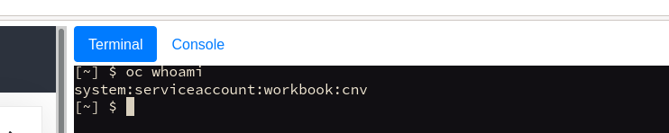

Welcome to the OpenShift Virtualization self-paced lab guide/workbook. We've put this together to give you an overview and technical deep dive into how OpenShift Virtualization works, and how it continues to bring advanced virtualisation capabilities to OpenShift.

**OpenShift Virtualization** is now the official *product name* for the Container-native Virtualization operator for OpenShift. This has more commonly been referred to as "**CNV**" and is the downstream offering for the upstream [Kubevirt project](https://kubevirt.io/). While some aspects of this lab will still have references to "CNV", any reference to "CNV", "Container-native Virtualization" and "OpenShift Virtualization" can be *somewhat* used interchangeably.

In these labs you'll utilise a virtual environment built with the [OpenShift AIO](https://github.com/RHFieldProductManagement/openshift-aio) concept that mimic as close as (feasibly) possible to a **real** [baremetal IPI](https://metal3.io/) OpenShift 4.9 deployment. In this hands-on lab you won't need to deploy OpenShift, that'll already be deployed for you, but aside from this lab guide, it's a completely empty cluster, ready to be configured and used with OpenShift Virtualization. The default configuration will have automatically deployed [OpenShift Data Foundation](https://www.redhat.com/en/technologies/cloud-computing/openshift-data-foundation) (formerly known as OpenShift Container Storage/OCS) for all storage needs, but the base infrastructure also has NFS available if you've chosen not to use it (depending on how you've deployed openshift-aio).

This is the self-hosted lab guide that will run you through the following:

- *Validating the OpenShift deployment*
- *Give you an overview of the Lab Guide ([Homeroom](https://github.com/openshift-homeroom)) itself*
- *Exploring the OpenShift CLI and Web Console*
- *Deploying OpenShift Virtualization*
- *Setting up Storage for OpenShift Virtualization*
- *Setting up Networking for OpenShift Virtualization*
- *Performing Live Migrations and Node Maintenance*
- *Creating Virtual Machines from Snapshot*s
- *Cloning a Virtual Machine*
- *Utilising Pod Networking for VM's*
- *Deploying a real-world application example with ParksMap*
- *Performing Backup and Restore of Virtual Machines*
- *Implementing Network Isolation for Virtual Machines*

Within the lab you can click a button to inject the commands into the CLI, but sometimes you will need to cut and paste commands directly from the instructions; but also be sure to review all commands carefully both for functionality and syntax!

> **NOTE**: In some browsers and operating systems you may need to use Ctrl-Shift-C / Ctrl-Shift-V to copy/paste within this lab environment!

Please be very aware, we're continuing to update this for the latest OpenShift 4.9 release, therefore there may be some bugs/typo's, and we very much welcome feedback on the content, what's missing, what would be good to have, etc. Please feel free to submit PR's or raise [GitHub issues](https://github.com/RHFieldProductManagement/openshift-aio/issues/new), we're glad of the feedback!

Lastly, this page dynamically allows you to switch between the OpenShift CLI and the OpenShift console, without having to login. Simply use these two buttons at the top of the screen to switch between them whilst keeping the instructions on the left-hand side:

When you're ready, select "Using Homeroom" at the bottom to get started...

